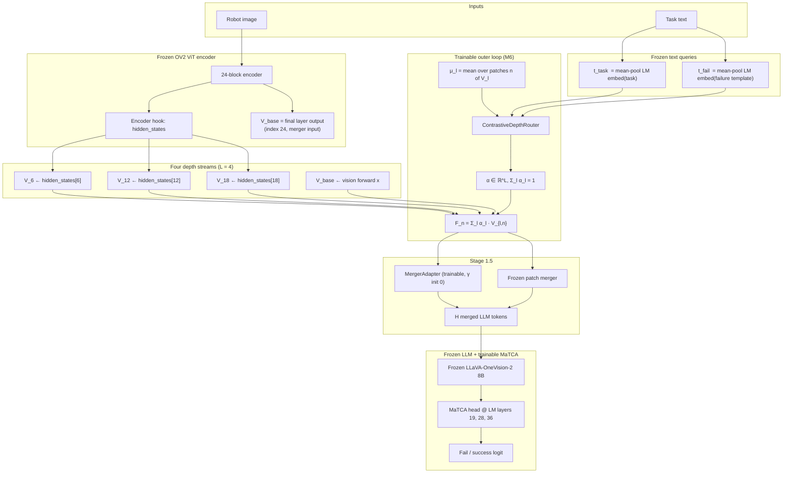
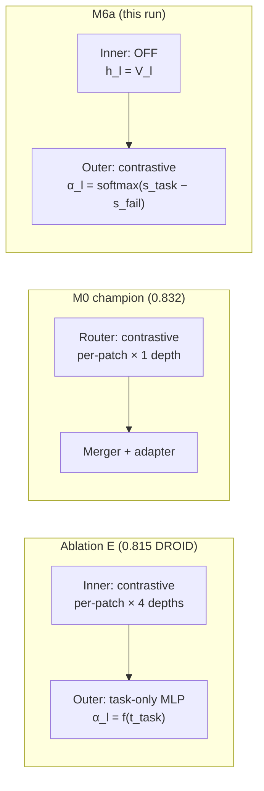

# M6a — Contrastive Outer-Only NGF (COD-α)

Readable reference for **Run M6a** (`results_ov2_calvin_m6_cod_alpha_replace`): multilayer ViT fusion with **task−failure contrastive routing at depth only**, no inner per-patch guiding. Companion design doc: [`OUTER_CONTRASTIVE_DEPTH_OPTION_A.md`](OUTER_CONTRASTIVE_DEPTH_OPTION_A.md).

**One sentence:** Hook intermediate ViT depths plus the native final layer, mix them with contrastive depth weights `α_l = softmax(s_task − s_fail)`, project through the frozen merger (+ adapter), then classify with the frozen LLM + MaTCA head.

---

## 1. End-to-end pipeline



**M6a-specific choices (vs Ablation E):**

| Piece | Ablation E | **M6a** |
|-------|------------|---------|
| Inner loop | contrastive per-patch × 4 depths | **off** (`h_l = V_l`) |
| Outer loop | task-only MLP → `α_l` | **contrastive** `s_task − s_fail` |
| Depths | 6, 12, 18 + base | same |
| Merger output | replace `V_base` with `F` | same (`replace_base`) |

---

## 2. Notation (OV2-8B defaults)

| Symbol | Typical shape | Meaning |
|--------|---------------|---------|
| `B` | 1 | batch (forced to 1 when NGF active) |
| `N` | ~928 | ViT patch tokens per image (varies with resolution) |
| `M` | ~232 | merged LLM tokens after 2×2 patch merge |
| `D_v` | 1024 | ViT hidden dim (`vision_config.hidden_size`) |
| `D_q` | 4096 | LM / query dim (`text_config.hidden_size`) |
| `D_r` | 256 | router bottleneck (`router_dim` / `alf_router_dim`) |
| `L` | **4** | depths: indices `6, 12, 18` + **base** |

**Depth index map (encoder `hidden_states` tuple):**

| Label | Tuple index | How obtained |
|-------|-------------|--------------|
| `V_6` | 6 | encoder hook |
| `V_12` | 12 | encoder hook |
| `V_18` | 18 | encoder hook |
| `V_base` | 24 (= `[-1]`) | native vision forward **before** merger (not in `--vision_layer_indices`) |

Do **not** put `24` in `--vision_layer_indices` — base is appended automatically in code.

---

## 3. Stage-by-stage calculations

### 3.1 Text queries (frozen)

Task and failure-template strings are embedded with the **frozen** LM embedding table; each is mean-pooled over tokens:

```text
t_task  = mean_token Embed_LM("pick up the red block")     ∈ ℝ^{B × D_q}
t_fail  = mean_token Embed_LM("Visual evidence that the following robot task
                               was not successfully completed: pick up ...")
```

These are computed once per forward in `_compute_query_embeddings()` and reused by the outer router.

---

### 3.2 Inner loop — **disabled in M6a**

Full NGF (Ablation E) uses per-patch contrastive guiding:

```text
h_{l,n} = V_{l,n} + β_l · Δ_{l,n}        # β_l init 0
```

**M6a** sets `--ngf_no_inner`, so:

```text
h_l = V_l     (identity; no Δ, no per-patch gates)
```

All contrastive signal is deferred to the **outer** depth router only.

---

### 3.3 Depth summaries

Stack the four depth tensors (same patch count `N`):

```text
stacked[b, l, n, :] = V_l[b, n, :]     # l ∈ {0,1,2,3} ↔ depths {6,12,18,base}

μ_l = (1/N) Σ_n  V_{l,n}              ∈ ℝ^{D_v}   (mean pool over patches)
```

In code (`ContrastiveDepthRouter.forward`):

```python
mu = stacked.mean(dim=2)   # [B, L, D_v]
```

---

### 3.4 Contrastive depth router (trainable)

Project summaries and queries into a shared router space `D_r = 256`:

```text
K_l     = W_K · μ_l                       ∈ ℝ^{D_r}      (per depth l)
q_task  = W_Qt · t_task                   ∈ ℝ^{D_r}
q_fail  = W_Qf · t_fail                   ∈ ℝ^{D_r}

s_task,l = (1/√D_r) · ⟨q_task, K_l⟩
s_fail,l = (1/√D_r) · ⟨q_fail, K_l⟩

logit_l  = s_task,l − s_fail,l              # contrastive depth score

α_l      = exp(logit_l) / Σ_{l′} exp(logit_{l′})     # softmax over L=4 depths
```

**Batch shape:** `α ∈ ℝ^{B × L}`; for `B=1`, `α` is a single 4-vector logged as `NGF layer alpha` with labels `[6, 12, 18, base]`.

**Grounding invariant:** text enters only through dot products in `logit_l`. The fused field uses **raw visual** `V_l`, never text embeddings in the values.

Implementation: `ContrastiveDepthRouter` in `src/model_ov2_routed_matca.py`.

---

### 3.5 Outer fusion (replace base)

Same depth weight `α_l` for **every** patch position `n` (TGIF-style outer mixing):

```text
F_n = Σ_{l=0}^{L-1}  α_l · V_{l,n}        ∈ ℝ^{D_v}     for each n = 1…N
```

Tensor form:

```text
F = Σ_l  α_l · stacked[:, l, :, :]       # [B, N, D_v]
```

**M6a** uses `replace_base=True` (default; no `--nested_residual`):

```text
merger_input = F                          # F fully replaces V_base
```

**M6b** (`--nested_residual`) would instead use:

```text
merger_input = V_base + η · (F − V_base)   # η init 0 → starts as V_base
```

---

### 3.6 Merger + adapter (Stage 1.5)

Frozen native patch merger plus parallel low-rank adapter (M0-style, on **pre-merger** `D_v` tokens):

```text
LN_q(x)  = LayerNorm on patch dim inside frozen merger

H_base   = Merger_frozen(F)               ∈ ℝ^{M × D_q}
H_adapt  = Adapter(F)                     # rank-64 MLP on F
H        = H_base + γ · H_adapt           # γ init 0 → starts as frozen merger only
```

`H` is the sequence of image tokens injected into the frozen LLM at image-token positions.

---

### 3.7 Frozen LLM + MaTCA head (Stage 2)

```text
LM_hidden = FrozenLLM(text_tokens, image_tokens = H)

For each target layer ℓ ∈ {19, 28, 36}:
    z_ℓ     = tcond_pool(LM_hidden[ℓ], text_mask)     # task-conditioned pooling
    logit_ℓ = classifier_ℓ(z_ℓ)

logit_fused = fused_classifier( fusion(z_19, z_28, z_36) )
```

Training loss (default `--loss_mode fusion`):

```text
L = BCEWithLogits(logit_fused, y) + L_aux
```

---

### 3.8 Auxiliary depth-entropy loss

When `--layer_balance_coef = 0.01` (M6a default):

```text
L_aux = λ · Σ_l  α_l · log(α_l)          # λ = layer_balance_coef
```

Minimizing `L_aux` encourages **spread** across depths (penalizes collapse to a single layer). Logged as `aux=` in training; negative value is expected when entropy is encouraged.

---

## 4. Compact equation block (copy-paste)

```text
# Depths
V_l  for l ∈ {6, 12, 18, base},   h_l = V_l                    (M6a: no inner)

# Contrastive outer
μ_l = mean_n(V_l)
α = softmax_l( ⟨W_Qt t_task, W_K μ_l⟩/√D_r − ⟨W_Qf t_fail, W_K μ_l⟩/√D_r )

# Fuse + project
F_n = Σ_l α_l V_{l,n}
H = Merger(F) + γ·Adapter(F)

# Classify
ŷ = σ( MaTCA_fused( FrozenLLM(H, text) ) )
```

---

## 5. What is trainable vs frozen

| Module | M6a |
|--------|-----|
| ViT encoder | frozen |
| `ContrastiveDepthRouter` (`W_K`, `W_Qt`, `W_Qf`) | **trainable** |
| Inner `DualQueryRouterCore` | **not used** |
| `MergerAdapter` | **trainable** (γ init 0) |
| Native patch merger | frozen |
| LLaVA-OneVision-2 8B | frozen |
| MaTCA head (pooling + classifiers + layer fusion) | **trainable** |

---

## 6. M6a training CLI (reference)

```bash
--use_nested_guided_fusion
--ngf_no_inner
--ngf_layer_weight_mode contrastive
--vision_layer_indices 6 12 18          # base added automatically → L=4
--ngf_tap block
--use_merger_adapter --merger_adapter_rank 64
--router_mode contrastive --gate_style guiding   # inner-off; kept for config parity
--layer_balance_coef 0.01
--num_epochs 5 --lr 1e-4 --batch_size 1
# NO --nested_residual  → replace_base (M6a)
# NO --ngf_intermediate_only  → base depth included
```

Scripts: `scripts/a6000_overnight_m6_cod_alpha.sh`, `gadi_scripts/ov2_routing/32_train_eval_m6_cod_alpha.sh`

---

## 7. Comparison diagram (where text acts)



**Hypothesis under test:** E’s inner+outer text routing is redundant; M6a keeps multilayer + contrastive but only at **depth** granularity (closer to TGIF outer + M0 contrastive signal).

---

## 8. Success criteria (reminder)

| Baseline | DROID AUROC |
|----------|-------------|
| M0 champion | **0.832** |
| Ablation E | **0.815** |
| A2 inner-off | 0.809 |
| **M6a target** | beat **0.815** |

Primary metric: `eval_results/ov2_calvin_m6_cod_alpha_replace_to_droid/results.json` → `auroc`  
Secondary: `ngf_layer_alpha`, `grounding_flip_rate`, CALVIN in-domain AUROC.

---

## 9. Code map

| Piece | Location |
|-------|----------|
| `ContrastiveDepthRouter` | `src/model_ov2_routed_matca.py` |
| `NestedGuidedFusion` (outer fuse) | same file |
| Base depth append | `apply_upstream()` → `layer_tokens.append(x32)` |
| Merger adapter | `MergerAdapter`, `_AdaptedRoutedMerger` |
| CLI | `src/finetune_FS_ov2_routed.py` |

---

*Generated for aloha-server run `results_ov2_calvin_m6_cod_alpha_replace` (Jul 2026).*
