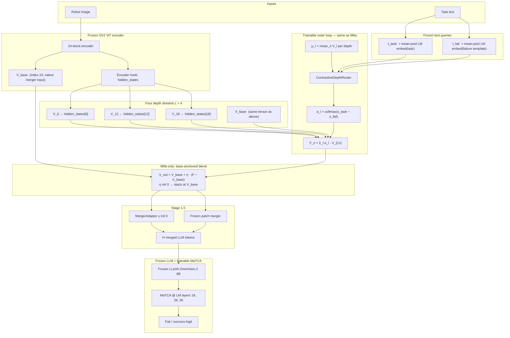

# M6b — Contrastive Outer-Only NGF + Base Residual (COD-α + η)

Readable reference for the **current local champion** (`results_ov2_calvin_m6_cod_alpha_residual`): same multilayer **contrastive depth routing** as M6a, but the fused field is **blended into** `V_base` instead of replacing it.

Companion docs: [`M6A_ARCHITECTURE.md`](M6A_ARCHITECTURE.md) · [`OUTER_CONTRASTIVE_DEPTH_OPTION_A.md`](OUTER_CONTRASTIVE_DEPTH_OPTION_A.md) · [`M6A_PAPER_BRIEFING.md`](M6A_PAPER_BRIEFING.md)

**One sentence:** Hook ViT depths {6, 12, 18} + base, mix them with contrastive depth weights `α_l = softmax(s_task − s_fail)`, then **anchor** the result to the native merger input via `V_out = V_base + η(F − V_base)` before frozen merger + adapter → frozen LLM → MaTCA.

---

## 1. Why M6b exists (M6a → M6b)

| Variant | Pre-merger tokens | DROID AUROC (local A6000) |
|---------|-------------------|---------------------------|
| **M6a** replace | `F` only | 0.819 |
| **M6b** residual | `V_base + η(F − V_base)` | **0.831** |
| M0 flat router | `V_base + β·Δ` (single depth) | 0.823 |

M6a **fully replaces** the native final ViT field with the depth mixture `F`. That can disturb the frozen merger, which was trained on `V_base`-like statistics. M6b keeps the **native anchor** and learns a bounded correction toward the multilayer fused field.

At init, `η = 0` ⇒ `V_out = V_base` (identity — same safe start as M0’s `β = 0`).

---

## 2. End-to-end pipeline



---

## 3. M6a vs M6b — the only architectural difference

Everything through the **contrastive outer loop** is identical to M6a (inner off, depths 6/12/18 + base, `ContrastiveDepthRouter`).

| Piece | M6a | **M6b** |
|-------|-----|---------|
| Inner loop | off (`h_l = V_l`) | off |
| Outer router | contrastive depth `α_l` | same |
| Depths | 6, 12, 18 + base | same |
| **Merger input** | `F` replaces `V_base` | **`V_out = V_base + η(F − V_base)`** |
| CLI flag | default (`replace_base=True`) | **`--nested_residual`** |
| Trainable scalar | — | **`η`** (init 0) |

Code path in `NestedGuidedFusion.forward`:

```604:606:src/model_ov2_routed_matca.py
        if self.replace_base:
            return fused
        return v_base + self.eta * (fused - v_base)
```

M6b sets `replace_base=False` via `--nested_residual` → `nested_replace_base=not args.nested_residual` in the training driver.

---

## 4. Equations (compact)

### 4.1 Contrastive depth weights (outer — unchanged from M6a)

```text
μ_l     = (1/N) Σ_n V_{l,n}                              # depth summary
K_l     = W_K · μ_l
s_task  = (W_Qt · t_task) · K_l / √D_r
s_fail  = (W_Qf · t_fail) · K_l / √D_r
α_l     = softmax_l(s_task − s_fail)                   # Σ_l α_l = 1
```

### 4.2 Depth fusion (visual only)

```text
F_n = Σ_l α_l · V_{l,n}                                  # same α for all patches n
```

**Grounding invariant:** text only produces `α_l`; `F` is a weighted sum of **pure visual** depth tensors.

### 4.3 M6b base-anchored output (the champion change)

```text
V_out = V_base + η · (F − V_base)
      = (1 − η) · V_base + η · F                         # convex blend when 0 ≤ η ≤ 1
```

At training start: `η = 0` ⇒ `V_out = V_base`.

Interpretation:
- **η → 0:** trust native final ViT + frozen merger path (like baseline).
- **η → 1:** equivalent to M6a replace (`F` only).
- Learned **η** picks how much multilayer contrastive mixing to inject without throwing away the pretrained merger input distribution.

### 4.4 Merger + adapter + head

```text
H = Merger_frozen(V_out) + γ · Adapter(V_out)            # γ init 0
→ Frozen LLM → MaTCA fusion logit → BCE loss
```

Optional depth-entropy aux (default `layer_balance_coef=0.01`): encourages spread in `α_l`.

---

## 5. ASCII data-flow (single patch index n)

```text
         t_task, t_fail
              │
              ▼
    ┌─────────────────────┐
    │ ContrastiveDepthRouter │──► α = [α_6, α_12, α_18, α_base]
    └─────────────────────┘
              │
   V_6[n] V_12[n] V_18[n] V_base[n]
              │
              ▼
         F[n] = Σ_l α_l · V_l[n]
              │
              ▼
    V_out[n] = V_base[n] + η · (F[n] − V_base[n])    ◄── M6b only
              │
              ▼
    Merger(V_out) + γ·Adapter(V_out)  →  LLM  →  MaTCA
```

---

## 6. How to run (A6000)

Same script as M6a with residual flag:

```bash
NESTED_RESIDUAL=1 bash scripts/a6000_overnight_m6_cod_alpha.sh
# or full chain with eval:
bash scripts/a6000_chain_overnight_m6b_inner_on.sh   # leg 1 only is M6b
```

Effective flags:

```text
--use_nested_guided_fusion
--ngf_no_inner
--ngf_layer_weight_mode contrastive
--vision_layer_indices 6 12 18
--nested_residual                    # ◄── M6b
--use_merger_adapter
--layer_balance_coef 0.01
```

**Do not** set both replace and residual — `--nested_residual` flips `nested_replace_base=False`.

---

## 7. Local results (A6000, CALVIN train → eval)

Primary metric: **CALVIN → DROID AUROC** (balanced DROID via `augment_droid_dataset`).

| Method | CALVIN AUROC | DROID AUROC | Checkpoint dir |
|--------|-------------:|------------:|----------------|
| **M6b (champion)** | **0.976** | **0.831** | `results_ov2_calvin_m6_cod_alpha_residual` |
| M0 flat router | 0.979 | 0.823 | `results_ov2_calvin_m0_merger_adapter` |
| M6a replace | 0.974 | 0.819 | `results_ov2_calvin_m6_cod_alpha_replace` |
| M6-inner-on | 0.990 | 0.803 | `results_ov2_calvin_m6_cod_alpha_inner_on` |
| M6 task-only outer | 0.993 | 0.784 | `results_ov2_calvin_m6_task_only_outer` |
| every3 (8 depths) | 0.985 | 0.805 | `results_ov2_calvin_m6_cod_alpha_every3` |
| Ablation E | 0.981 | 0.749 | `results_ov2_calvin_ngf_v2_e618` |

Eval JSON:
- `eval_results/ov2_calvin_m6_cod_alpha_residual_indomain/results.json`
- `eval_results/ov2_calvin_m6_cod_alpha_residual_to_droid/results.json`

Training log: `train_m6_cod_alpha_residual.log`  
Chain log: `chain_overnight_m6b_inner_on.log` (leg 1)

**Observed depth weights:** `ngf_layer_alpha ≈ [0.25, 0.25, 0.25, 0.25]` — uniform, no depth collapse.

---

## 8. Ablation story (what M6b isolates)

| Comparison | What it proves |
|------------|----------------|
| **M6b vs M6a** | Residual anchoring to `V_base` helps transfer (+0.012 DROID AUROC locally) |
| **M6b vs M0** | Multilayer contrastive depth routing can beat flat single-layer patch router |
| **M6b vs task-only outer** | Contrastive `(task − fail)` outer matters (0.831 vs 0.784) |
| **M6b vs inner-on** | Inner per-patch routing hurts OOD even with contrastive outer |
| **M6b vs every3** | More hooked depths ≠ better (4 well-chosen depths enough) |

---

## 9. Paper one-liner (draft)

> We inject task–failure contrastive signals **once**, at **ViT depth granularity**, fuse intermediate layers into `F`, and **blend** into the native merger field via `V_base + η(F − V_base)` so the frozen connector stays anchored. On CALVIN→DROID transfer, this **M6b** design achieves the best local DROID AUROC (**0.831**), outperforming flat contrastive routing (M0, 0.823) and full replacement (M6a, 0.819).

---

## 10. Module map (code)

| Component | File | M6b role |
|-----------|------|----------|
| `ContrastiveDepthRouter` | `src/model_ov2_routed_matca.py` | Outer `α_l` from `s_task − s_fail` |
| `NestedGuidedFusion` + `η` | same | `V_out = V_base + η(F − V_base)` |
| `_AdaptedRoutedMerger` | same | `apply_upstream` → merger + adapter |
| Train CLI | `src/finetune_FS_ov2_routed.py` | `--nested_residual` |
| Eval + `ngf_layer_alpha` | `src/evaluate_FS_ov2_routed.py` | diagnostics |
| Train script | `scripts/a6000_overnight_m6_cod_alpha.sh` | `NESTED_RESIDUAL=1` |

---

## 11. Related method IDs (keep straight)

| ID | Short name |
|----|------------|
| M0 | Flat `DualQueryRouter` @ `V_base` + adapter |
| M6a | COD-α, replace `V_base` with `F` |
| **M6b** | **COD-α + η residual blend (champion)** |
| E | Inner patch ×4 + task-only outer |
| A2 / task-only | Inner off + task-only outer (M6 task-only outer run) |
