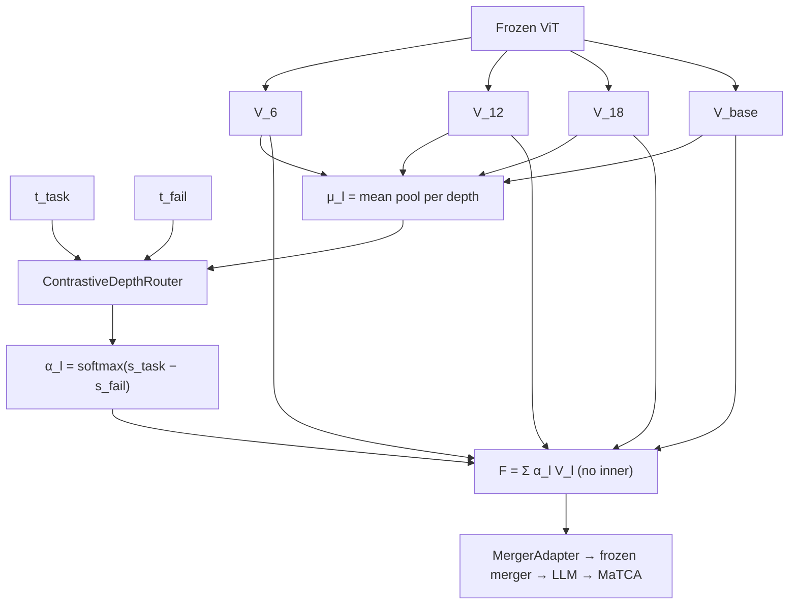

# Outer Contrastive Depth Routing — Option A (Handoff for A6000 Agent)

**Method ID (proposed):** `M6` — *Contrastive outer-only NGF (COD-α)*  
**Status:** Design / **implemented** (Jul 2026, branch `trans_1Jul2026`)  
**Author intent:** Test whether **task–failure contrastive routing at depth granularity only** (no inner per-patch guiding) improves CALVIN→DROID transfer vs full NGF E (0.815) and M0 (0.832).

---

## 1. Motivation

| Run | Inner | Outer | DROID AUROC |
|-----|-------|-------|-------------|
| **M0** | contrastive patches, **1×** on `V_base` | — | **0.832** |
| **A2 (M1)** | **off** (`h_l = V_l`) | task-only `TextLayerRouter` | 0.809 |
| **Ablation E** | contrastive **×4 depths** | task-only `α_l` | **0.815** |

**Hypothesis:** Inner + outer both use text → redundant capacity → CALVIN overfit.  
Literature (TGIF, IGVA) uses **one** text injection for **depth mixing**.  
**Proposal:** Keep multilayer + contrastive, but **only in the outer loop** — depth-level `(task − fail)` logits, not per-patch gates at every depth.

---

## 2. Method (Option A — Contrastive depth logits)

### 2.1 Pipeline

```text
Frozen ViT → hook V_l for l ∈ {6, 12, 18} + V_base
Inner:      h_l = V_l                    # --ngf_no_inner (no DualQueryRouterCore)
Outer:      α = ContrastiveDepthRouter(t_task, t_fail, {V_l})
            F_n = Σ_l α_l · h_{l,n}      # same α for all patches n
Merger:     H = Merger_frozen(F) + γ·Adapter(F)
LLM:        frozen → MaTCA → logit
```

### 2.2 Notation

| Symbol | Shape | Meaning |
|--------|-------|---------|
| `L` | 4 | depths: indices `6, 12, 18` + `base` |
| `V_l` | `[B, N, D_v]` | hooked ViT patches (`D_v=4096`) |
| `t_task`, `t_fail` | `[B, D_q]` | frozen LM mean-pooled embeddings |
| `μ_l` | `[B, D_v]` | depth summary, e.g. `mean_n V_l[:,n,:]` |
| `α` | `[B, L]` | `softmax` over depths, sums to 1 |
| `F` | `[B, N, D_v]` | fused field → merger input |

### 2.3 Contrastive depth router (new module)

Replace `TextLayerRouter` (task-only MLP) when `ngf_layer_weight_mode=contrastive`.

```text
K_l = W_K · μ_l                         # [B, D_r],  D_r = router_dim (256)
q_task = W_Qt · t_task                  # [B, D_r]
q_fail = W_Qf · t_fail                  # [B, D_r]

s_task,l = ⟨q_task, K_l⟩ / √D_r
s_fail,l = ⟨q_fail, K_l⟩ / √D_r

logit_l = s_task,l − s_fail,l           # primary contrastive mode (Option A)
α = softmax_l(logit_l)                  # [B, L]
```

**Grounding invariant (same as patch router):** text only scores depths via dot products; fused field is `Σ α_l V_l` (purely visual features). No text content in `F`.

**Optional ablations (later):**

- `logit_l = s_task,l` only (reproduces A2-style if inner off)
- `logit_l = [s_task,l, s_fail,l, s_task,l − s_fail,l]` → linear → scalar (3-stream depth analogue)
- Layer summaries: CLS token if available; else `mean_n V_l`

### 2.4 Fusion

```text
stacked = stack([V_6, V_12, V_18, V_base], dim=1)    # [B, L, N, D_v]
F = sum_l α_{b,l} · stacked[b, l, :, :]               # [B, N, D_v]
```

With `--ngf_no_inner`: `h_l = V_l` (identical to using `V_l` directly).

### 2.5 Merger input / anchoring

| Flag | Merger sees | Default for first run |
|------|-------------|------------------------|
| (none) | `F` replaces `V_base` | **Run 1** — match Ablation E |
| `--nested_residual` | `V_base + η·(F − V_base)`, η init 0 | **Run 2** — M0-style anchor |

---

## 3. Comparison to existing code

| Piece | Current | Option A |
|-------|---------|----------|
| Class | `TextLayerRouter` | **`ContrastiveDepthRouter`** (new) |
| File | `src/model_ov2_routed_matca.py` | same |
| Wired in | `NestedGuidedFusion._alpha()` when `layer_weight_mode=='text'` | when `layer_weight_mode=='contrastive'` |
| Inner | `DualQueryRouterCore` if `inner_guiding` | **`--ngf_no_inner`** |
| CLI | `--ngf_layer_weight_mode text` | `--ngf_layer_weight_mode contrastive` |

**Do not confuse with:**

- `--router_mode contrastive` on **flat** `--use_router` (M0 path)
- `--use_hier_router` Design C (per-depth Δ + depth fuse)

---

## 4. Implementation checklist (agent)

### 4.1 Code

- [x] Add `ContrastiveDepthRouter(nn.Module)` next to `TextLayerRouter` in `model_ov2_routed_matca.py`
- [x] In `NestedGuidedFusion.__init__`: `elif layer_weight_mode == "contrastive"`: instantiate `ContrastiveDepthRouter`
- [x] In `NestedGuidedFusion.forward`: pass `stacked`, `t_task`, `t_fail` into contrastive router
- [x] `finetune_FS_ov2_routed.py`: add `contrastive` to `--ngf_layer_weight_mode` choices
- [x] `evaluate_FS_ov2_routed.py`: save/load `ngf_layer_weight_mode`; log `ngf_layer_alpha` as today
- [x] Checkpoint config: persist `ngf_layer_weight_mode=contrastive`

### 4.2 Pseudocode (`ContrastiveDepthRouter`)

```python
class ContrastiveDepthRouter(nn.Module):
    """Depth-level task vs failure contrastive weights (Option A / M6)."""

    def __init__(self, vision_dim, query_dim, num_layers, router_dim=256):
        super().__init__()
        self.w_k = nn.Linear(vision_dim, router_dim)
        self.w_qt = nn.Linear(query_dim, router_dim)
        self.w_qf = nn.Linear(query_dim, router_dim)
        self.scale = router_dim ** -0.5

    def forward(self, stacked, t_task, t_fail):
        # stacked: [B, L, N, Dv]
        mu = stacked.mean(dim=2)                    # [B, L, Dv]
        keys = self.w_k(mu)                         # [B, L, Dr]
        qt = self.w_qt(t_task).unsqueeze(1)           # [B, 1, Dr]
        qf = self.w_qf(t_fail).unsqueeze(1)
        s_task = (qt * keys).sum(-1) * self.scale    # [B, L]
        s_fail = (qf * keys).sum(-1) * self.scale
        logits = s_task - s_fail
        return torch.softmax(logits, dim=-1)         # [B, L]
```

Wire in `NestedGuidedFusion.forward` outer branch (when not token mode):

```python
if self.layer_weight_mode == "contrastive":
    alpha = self.layer_router(stacked, t_task, t_fail)
```

Requires passing `t_fail` into `nested_fusion.forward` (already has it).

### 4.3 Smoke test

```bash
cd ~/robot_failure_classifier/I-FailSense-main
source .venv-ov2/bin/activate
export PYTHONPATH=src
export HF_HOME=/Disk1/enoch/hf_cache
export VLM_MODEL=/Disk1/enoch/models/LLaVA-OneVision-2-8B-Instruct

python src/finetune_FS_ov2_routed.py \
  --vlm_model_id "${VLM_MODEL}" \
  --dataset_name calvin --pov 1 --num_epochs 1 --batch_size 1 \
  --use_nested_guided_fusion --ngf_no_inner \
  --ngf_layer_weight_mode contrastive \
  --vision_layer_indices 6 12 18 \
  --ngf_tap block --use_merger_adapter --merger_adapter_rank 64 \
  --router_mode contrastive --gate_style guiding \
  --layer_balance_coef 0.01 \
  --target_layer_indices 19 28 36 --pooling_mode tcond \
  --result_folder ./results_smoke_cod_alpha
```

---

## 5. Full experiments (match Ablation E stack)

### Run M6a — replace base (like E)

Use the same hyperparams as Ablation E (`gadi_scripts/ov2_routing/_run_phase1_ablation.sh E`) with these overrides:

- `--ngf_no_inner`
- `--ngf_layer_weight_mode contrastive`

```bash
RESULT_DIR=./results_ov2_calvin_m6_cod_alpha_replace
EVAL_IN=./eval_results/ov2_calvin_m6_cod_alpha_replace_indomain
EVAL_X=./eval_results/ov2_calvin_m6_cod_alpha_replace_to_droid

python src/finetune_FS_ov2_routed.py \
  --vlm_model_id "${VLM_MODEL}" \
  --dataset_name calvin --pov 1 \
  --num_epochs 5 --batch_size 1 \
  --target_layer_indices 19 28 36 --num_classifiers 3 \
  --pooling_mode tcond --loss_mode fusion --prediction_mode fusion \
  --use_nested_guided_fusion --ngf_no_inner \
  --ngf_layer_weight_mode contrastive \
  --vision_layer_indices 6 12 18 \
  --ngf_tap block --use_merger_adapter --merger_adapter_rank 64 \
  --router_mode contrastive --gate_type sigmoid --gate_style guiding \
  --layer_balance_coef 0.01 \
  --dropout_rate 0.1 --lr 1e-4 --weight_decay 0.1 \
  --result_folder "${RESULT_DIR}"

python src/evaluate_FS_ov2_routed.py \
  --vlm_model_id "${VLM_MODEL}" --fs_id "${RESULT_DIR}" \
  --dataset_name calvin --pov 1 --split test --batch_size 1 \
  --prediction_mode fusion --grounding_check --result_folder "${EVAL_IN}"

python src/evaluate_FS_ov2_routed.py \
  --vlm_model_id "${VLM_MODEL}" --fs_id "${RESULT_DIR}" \
  --dataset_name droid --pov 1 --split test --batch_size 1 \
  --prediction_mode fusion --grounding_check --result_folder "${EVAL_X}"
```

| Hyperparam | Value |
|------------|-------|
| depths | `6 12 18` + base |
| tap | `block` |
| inner | **off** (`--ngf_no_inner`) |
| outer | **contrastive** |
| adapter | rank 64 |
| anchor | `replace_base` (default) |
| epochs / lr | 5 / 1e-4 (match E) |
| seed | 42 |

### Run M6b — nested residual (anchor)

Same as M6a + `--nested_residual`:

```bash
RESULT_DIR=./results_ov2_calvin_m6_cod_alpha_residual
# ... add --nested_residual to train command above
```

### Baselines (reference)

| Tag | Result dir | DROID AUROC |
|-----|------------|-------------|
| M0 champion | `results_ov2_calvin_routed_merger_adapter` | **0.832** |
| Ablation E | `results_ov2_calvin_p1_ablate_E_ngf_v2_layers618` | **0.815** |
| A2 inner-off | `results_ov2_calvin_ngf_a2_inner_off` | 0.809 |
| A1 uniform α | `results_ov2_calvin_ngf_a1_uniform_v2` | 0.812 |

**Primary metric:** `eval_results/..._to_droid/results.json` → `auroc`  
**Secondary:** `grounding_flip_rate`, `ngf_layer_alpha`, in-domain AUROC.

### Success criteria

- **Win:** M6a or M6b **> 0.815** and approaches **0.832** (ideally with 3 seeds)
- **Useful negative:** M6 ≈ A2 (0.809) → contrastive outer does not beat task-only outer
- **Paper line:** depth-contrastive beats patch×depth (E) or loses to M0 → **granularity rule**

---

## 6. A6000 / aloha-server environment

```bash
# Paths (adjust if different)
REPO=~/robot_failure_classifier/I-FailSense-main
cd "${REPO}"
source .venv-ov2/bin/activate
export PYTHONPATH=src
export HF_HOME=/Disk1/enoch/hf_cache
export VLM_MODEL=/Disk1/enoch/models/LLaVA-OneVision-2-8B-Instruct
export TOKENIZERS_PARALLELISM=false
```

**GPU note:** If RTX 5090 / sm_120, PyTorch must be **CUDA 12.8+**:

```bash
pip install torch torchvision --index-url https://download.pytorch.org/whl/cu128
```

Verify CUDA before long jobs:

```bash
python -c "import torch; print(torch.cuda.get_device_name()); x=torch.randn(4,4,device='cuda'); print('ok')"
```

**Suggested script name (to create):** `gadi_scripts/ov2_routing/32_train_eval_m6_cod_alpha.sh`  
**A6000 (aloha-server):**

- `scripts/a6000_overnight_m6_cod_alpha.sh` — train M6a (or `NESTED_RESIDUAL=1` for M6b)
- `scripts/a6000_chain_to_m6_cod_alpha.sh` — wait for prior job, train + eval
- `scripts/a6000_smoke_m6_cod_alpha.sh` — 30-sample smoke

```bash
# After NGF E run finishes (auto-queued example):
nohup bash scripts/a6000_chain_to_m6_cod_alpha.sh >> chain_m6.log 2>&1 &
```

**Result dirs:**

- `results_ov2_calvin_m6_cod_alpha_replace`
- `results_ov2_calvin_m6_cod_alpha_residual`

**Git:** pull branch `trans_1Jul2026` (or whatever branch contains this file) on the server before implementing.

---

## 7. Paper positioning

| Method | Multilayer | Contrastive | Text granularity |
|--------|------------|-------------|------------------|
| TGIF | ✓ | ✗ | depth, task-only |
| M0 | ✗ | ✓ | patch, 1 depth |
| NGF E | ✓ | ✓ | patch × depth + task depth |
| **M6 (this)** | ✓ | ✓ | **depth only (task−fail)** |

One-sentence claim:

> Task–failure contrastive routing at **depth** granularity, without per-patch inner guiding, tests whether multilayer fusion should follow TGIF-style outer mixing while preserving the M0 contrastive signal.

---

## 8. Diagram



---

## 9. Agent task summary

1. Implement `ContrastiveDepthRouter` + `ngf_layer_weight_mode=contrastive`.
2. Smoke train 1 epoch on CALVIN.
3. Full train+eval **M6a** (replace) and **M6b** (`--nested_residual`) on depths `{6,12,18}`.
4. Report AUROC vs M0 (0.832) and Ablation E (0.815).
5. Update `EXPERIMENT_LOG.md` / `SUMMARY_OV2_RESULTS.md` if M6 wins.

**Out of scope for v1:** token-level outer (Arch B), post-merger ALF, ViT-internal text injection.

---

## 10. Related files in this repo

| File | Role |
|------|------|
| `src/model_ov2_routed_matca.py` | `NestedGuidedFusion`, `TextLayerRouter` — add `ContrastiveDepthRouter` here |
| `src/finetune_FS_ov2_routed.py` | CLI `--ngf_layer_weight_mode`, `--ngf_no_inner`, `--nested_residual` |
| `src/evaluate_FS_ov2_routed.py` | Eval + `ngf_layer_alpha` export |
| `gadi_scripts/ov2_routing/_run_phase1_ablation.sh` | Ablation E template (depths 6/12/18) |
| `gadi_scripts/ov2_routing/17_ablate_inner_off.sh` | A2 reference (inner off, task-only outer) |
| `eval_results/ov2_calvin_p1_ablate_E_ngf_v2_layers618_to_droid/results.json` | Verified 0.815 baseline |
