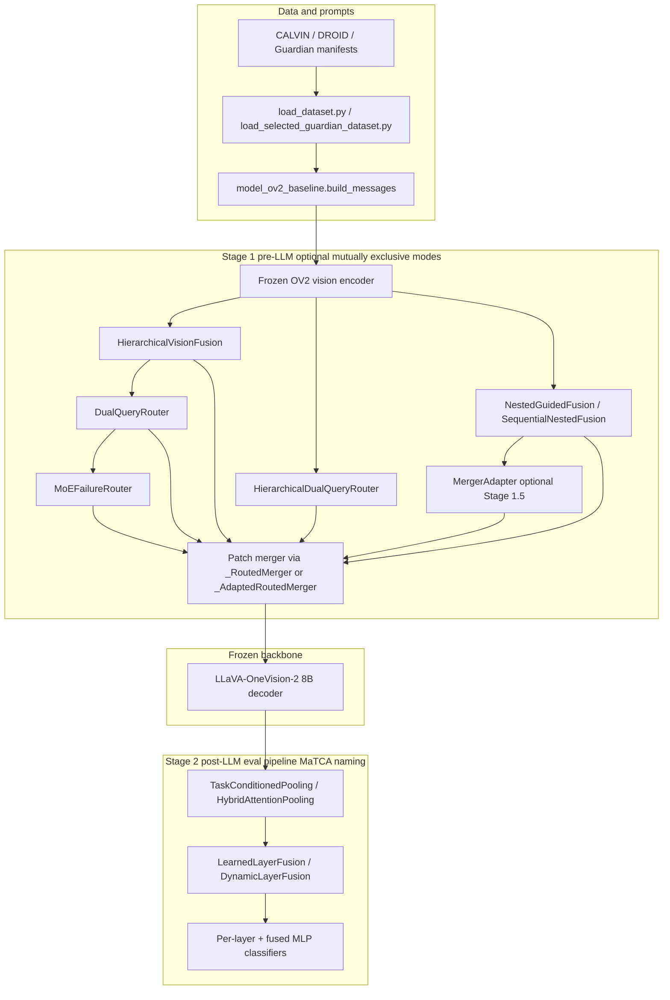
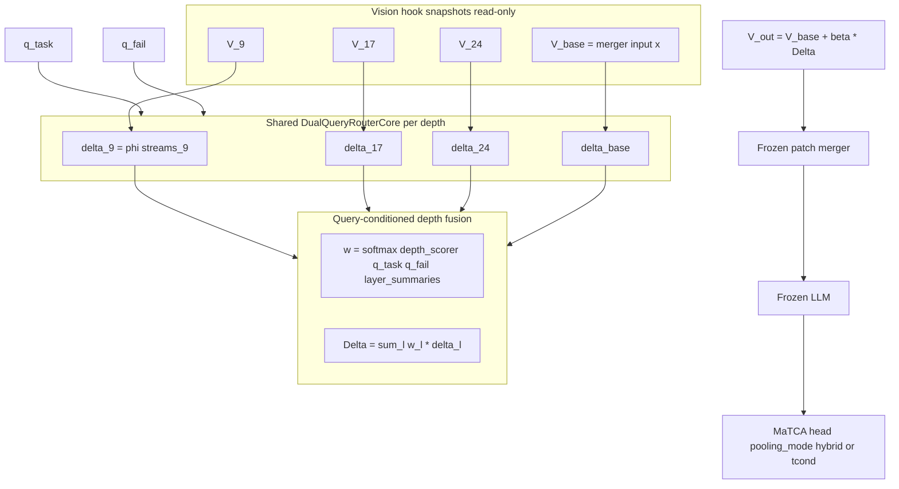
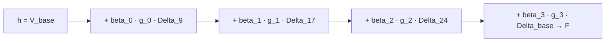

# OneVision-2 Routed MaTCA Architecture

This document describes the full OV2 routed failure-detection stack: module layout, data flow, trainable vs frozen components, and where each piece lives in the codebase.

## High-level pipeline



**Entry points**

| Script | Role |
|--------|------|
| [`src/finetune_FS_ov2_routed.py`](src/finetune_FS_ov2_routed.py) | Training CLI; builds `OV2RoutedMaTCA`, writes `config.txt` |
| [`src/evaluate_FS_ov2_routed.py`](src/evaluate_FS_ov2_routed.py) | Loads checkpoint, metrics + grounding probe |
| [`src/model_ov2_routed_matca.py`](src/model_ov2_routed_matca.py) | Core model + `train_model` / `validate_model` |

**GADI jobs (CALVIN-1p train → CALVIN + DROID eval)**

| Script | Stage-1 mode | Result dir | Notes |
|--------|--------------|------------|-------|
| [`02_train_eval_calvin_baseline.sh`](gadi_scripts/ov2_routing/02_train_eval_calvin_baseline.sh) | none | `results_ov2_calvin_baseline` | No Stage-1; fixed eval pipeline only, bs=2 |
| [`03_train_eval_calvin_routed.sh`](gadi_scripts/ov2_routing/03_train_eval_calvin_routed.sh) | `--use_router` | `results_ov2_calvin_routed` | Flat dual-query router |
| [`06_train_eval_calvin_moe.sh`](gadi_scripts/ov2_routing/06_train_eval_calvin_moe.sh) | `--use_moe` | `results_ov2_calvin_moe` | 4 experts, top-2 |
| [`09_train_eval_calvin_hier_routed.sh`](gadi_scripts/ov2_routing/09_train_eval_calvin_hier_routed.sh) | `--use_hier_router --pooling_mode hybrid` | `results_ov2_calvin_hier_routed` | Hierarchical router (Design C) |
| [`12_train_eval_calvin_routed_merger_adapter.sh`](gadi_scripts/ov2_routing/12_train_eval_calvin_routed_merger_adapter.sh) | `--use_router --use_merger_adapter` | `results_ov2_calvin_routed_merger_adapter` | Flat router + adapter |
| [`14–16_*`](gadi_scripts/ov2_routing/) | fuse-then-route / TGIF variants | various | See [`MERGER_ADAPTER_RUN.md`](MERGER_ADAPTER_RUN.md) |
| [`17_train_eval_calvin_nested_guided_fusion.sh`](gadi_scripts/ov2_routing/17_train_eval_calvin_nested_guided_fusion.sh) | `--use_nested_guided_fusion` | `results_ov2_calvin_ngf_v2` | **NGF-0 v2** (primary) |
| [`17_ablate_*.sh`](gadi_scripts/ov2_routing/) | NGF ablations A1–A8 | `results_ov2_calvin_ngf_a*_v2` | Ablation ladder |
| [`19_ngf_v2b_token_depth.sh`](gadi_scripts/ov2_routing/19_ngf_v2b_token_depth.sh) | NGF + `--ngf_layer_weight_mode token` | `results_ov2_calvin_ngf_v2b_token` | **Arch B** |
| [`19_ngf_v2c_sequential.sh`](gadi_scripts/ov2_routing/19_ngf_v2c_sequential.sh) | NGF + `--ngf_sequential` | `results_ov2_calvin_ngf_v2c_seq` | **Arch C** |
| [`20_ngf_v2c_seq_s*.sh`](gadi_scripts/ov2_routing/) | Arch C multi-seed | `results_ov2_calvin_ngf_v2c_seq_s{seed}` | Seeds 123, 2024 |
| [`21_ngf_v2_breg*.sh`](gadi_scripts/ov2_routing/) | NGF-0 + `--ngf_inner_beta_l2` | `results_ov2_calvin_ngf_v2_breg01/05` | Beta regularisation sweep |
| [`24_probe_vit_modules_phase0.sh`](gadi_scripts/ov2_routing/24_probe_vit_modules_phase0.sh) | frozen ViT probe | `eval_results/ov2_probe_phase0` | Phase 0 vision-only |
| [`25_ngf_ffn_act_intermediate.sh`](gadi_scripts/ov2_routing/25_ngf_ffn_act_intermediate.sh) | NGF FFN-Act intermediate-only | `results_ov2_calvin_ngf_ffn_act_intermediate` | **Phase 1 M5 — failed (0.498)** |
| [`26_probe_vit_modules_phase0b.sh`](gadi_scripts/ov2_routing/26_probe_vit_modules_phase0b.sh) | vision + text-guided probe | `eval_results/ov2_probe_phase0b` | Phase 0/0b |
| [`27_phase1_ablation_*.sh`](gadi_scripts/ov2_routing/) | Phase 1 isolation A–E | `results_ov2_calvin_p1_ablate_*` | Collapse attribution |

Submit batches: [`18_submit_overnight_ngf_v2.sh`](gadi_scripts/ov2_routing/18_submit_overnight_ngf_v2.sh), [`22_submit_followup_ngf_v2.sh`](gadi_scripts/ov2_routing/22_submit_followup_ngf_v2.sh), [`27_submit_phase1_ablation_matrix.sh`](gadi_scripts/ov2_routing/27_submit_phase1_ablation_matrix.sh).

**Paper plan & method IDs (M0–M5):** [`PAPER_PLAN.md`](PAPER_PLAN.md).

**Naming note:** *Design C* = hierarchical per-depth dual-query router (`--use_hier_router`). *Arch C* = sequential depth-recurrent NGF (`--ngf_sequential`). Different modules.

---

## Restored dependency modules

These were deleted/emptied on 2026-06-22 and restored for this run:

### [`src/model_ov2_baseline.py`](src/model_ov2_baseline.py)

Shared OV2 prompt + label utilities used by the routed model and eval.

| Symbol | Purpose |
|--------|---------|
| `DEFAULT_OV2_MODEL_ID` | HF id `lmms-lab-encoder/LLaVA-OneVision-2-8B-Instruct` |
| `DEFAULT_OV2_REVISION` | Pinned revision hash |
| `label_to_binary` | `fail → 0`, `success → 1` |
| `build_messages` | OV2 chat template user message (default or Guardian `prompt_style`) |
| `build_guardian_execution_content` | Multi-view Guardian layouts (`single_viewpoint`, `three_viewpoints`, `four_viewpoints`) |
| `OV2Baseline` | Raw OV2 generate/first-token baseline (for `evaluate_VLM_ov2.py` when restored) |

`OV2RoutedMaTCA._prepare_inputs` calls `build_messages` then `processor.apply_chat_template`, matching the baseline text format exactly.

### [`src/model_qwen_multilayer_fusion.py`](src/model_qwen_multilayer_fusion.py)

Post-LLM **MaTCA head** building blocks (shared with the Qwen3-VL pipeline; **personal eval pipeline — not a claimed contribution**). Imported by `model_ov2_routed_matca.py`:

- Task-conditioned attention pooling (I-FailSense-inspired)
- Fusion MLP over pooled LM layers (we use fusion instead of I-FailSense voting)

| Class | Role |
|-------|------|
| `TaskConditionedPooling` | Pools LM hidden states using **text-only** `task_repr` + attention over all tokens |
| `HybridAttentionPooling` | MLP + MHA hybrid pooling (alternative `--pooling_mode hybrid`) |
| `LearnedLayerFusion` | Static softmax weights over LM layers |
| `DynamicLayerFusion` | Per-sample layer weights (`--fusion_mode dynamic`) |
| `MLP_BLOCK` | Residual MLP used in classifiers |
| `QwenFailSenseMultiLayerFusion` | Full Qwen LoRA + same head (lazy `peft` import) |

Critical API for OV2 (`model_ov2_routed_matca._pool`):

```python
pooled, _, _ = self.att_poolings[layer_idx](
    features, text_mask=text_mask, attention_mask=attention_mask
)
```

`text_mask` excludes image/video placeholder tokens so task conditioning uses language tokens only.

---

## Stage 1a: Hierarchical vision fusion

**Class:** `HierarchicalVisionFusion` in [`model_ov2_routed_matca.py`](src/model_ov2_routed_matca.py) (lines 78–154)

**Enabled by:** `--use_hier_fusion --vision_layer_indices 9 17 24`

Before the patch merger, fuses multiple vision-encoder depths into a zero-init residual on the merger input:

```
V_hier = V_base + alpha * transform(sum_l w_l * V_l)    # alpha init = 0
```

- **Hook:** encoder forward hook stores `hidden_states`; `apply_upstream` runs inside `_RoutedMerger` before the native merger.
- **Stability:** `alpha = 0` at init → identity map through the pretrained vision-language interface.

---

## Stage 1b: Dual-query router

**Class:** `DualQueryRouter` + `DualQueryRouterCore` + `_PatchGate` in [`model_ov2_routed_matca.py`](src/model_ov2_routed_matca.py)

**Enabled by:** `--use_router` (or implicitly when `--use_moe`)

**Queries** (frozen LM embeddings, computed in `OV2RoutedMaTCA._compute_query_embeddings`):

- Task text from the dataset sample
- Failure template: `"Visual evidence that the following robot task was not successfully completed: {task}"`

**Grounding invariant:** text only forms scalar gates `g`; values `U = W_u(V)` are purely visual. Text never writes content into the routed residual.

**Modes (`--router_mode`):**

| Mode | Evidence streams |
|------|------------------|
| `task_only` | task-gated stream |
| `task_fail` | task + failure streams |
| `contrastive` | task, failure, and `(g_task - g_fail) * U` |

**Gate ablation (`--gate_style`):**

- `multiplicative`: sigmoid/softmax relevance scales `U`
- `guiding`: additive bias to learned per-patch base logits (QMSA-style)

Residual: `V_routed = V + beta * phi(streams)` with `beta` init 0.

---

## Stage 1c: Hierarchical per-depth dual-query router

**Class:** `HierarchicalDualQueryRouter` (shared `DualQueryRouterCore`) in [`model_ov2_routed_matca.py`](src/model_ov2_routed_matca.py)

**Enabled by:** `--use_hier_router --vision_layer_indices 9 17 24`

Mutually exclusive with `--use_router`, `--use_hier_fusion`, and `--use_moe`.

### Design C (detailed data flow)



**Design choices:**

- **Depth fusion:** query-conditioned `w_l` from `(q_task, q_fail)` + per-layer summaries (default; `--depth_fusion_mode static` ablation).
- **Router weights:** shared `W_K`, `W_U`, `W_Qt`, `W_Qf`, `phi`, `_PatchGate` across all depths.
- **Stage 2:** `--pooling_mode hybrid` recommended (task-agnostic MaTCA; router owns task/failure grounding).

For each depth `l` in `{9, 17, 24, base}`:

```
delta_l = core.compute_delta(V_l, q_task, q_fail)
w = depth_scorer(q_task, q_fail, mean_pool(V_l) ...)   # query-conditioned default
Delta = sum_l w_l * delta_l
V_out = V_base + beta * Delta,   beta init = 0
```

- **Hooks:** encoder forward hook stores the ``hidden_states`` tuple (indices 0..24 for the 24-block OV2 ViT); merger input is post-norm ``V_base``.
- **Depth fusion:** `--depth_fusion_mode query_cond` (default) or `static` ablation.
- **Recommended Stage-2 pairing:** `--pooling_mode hybrid` (task-agnostic MaTCA; router owns task/failure grounding).

---

## Stage 1b (alt): Mixture-of-Failure-Experts

**Class:** `MoEFailureRouter` in [`model_ov2_routed_matca.py`](src/model_ov2_routed_matca.py)

**Enabled by:** `--use_moe --num_experts 4 --moe_top_k 2`

Reuses `DualQueryRouter.build_streams` for gated visual evidence, then replaces single `phi` with:

- `E` expert MLPs
- Per-patch top-k gate over experts
- Relaxed load-balance aux loss (`--load_balance_coef`, default 0.01)
- Optional `--moe_gate_supervision` when `failure_mode_id` exists in data

CALVIN/DROID are binary-only → experts specialize latently.

---

## Stage 1d: Nested Guided Fusion (NGF)

**Classes:** `TextLayerRouter`, `TokenDepthRouter`, `NestedGuidedFusion`, `SequentialNestedFusion` in [`model_ov2_routed_matca.py`](src/model_ov2_routed_matca.py)

**Enabled by:** `--use_nested_guided_fusion` (mutually exclusive with every other Stage-1 toggle).

NGF factorizes multi-depth vision fusion into a nested `patch × depth` weighting that fully replaces `V_base` before the merger (or blends with `--nested_residual`).

### v2 inner residual (critical fix)

Original NGF replaced `V_l` with `phi(streams)`, causing collapse (~50% acc). **v2** uses identity-preserving per-depth residuals:

```
Delta_l = phi([V_l ; g_task·U ; g_fail·U ; (g_task−g_fail)·U])
h_l     = V_l + beta_l · Delta_l          # beta_l init = 0 → h_l = V_l at start
```

- **Inner loop:** one shared `DualQueryRouterCore` at each depth `l ∈ {9, 17, 24, base}`. Gates `g` are per-patch scalars; `U = W_u(V_l)` is purely visual (grounding invariant). Disable with `--ngf_no_inner` (then `h_l = V_l`, ablation A2).
- **Outer loop (parallel mode):** depth weights `alpha_l` mix the same patch index across depths: `F_n = Σ_l alpha_l · h_{l,n}`. Modes via `--ngf_layer_weight_mode`:
  - `text` — TGIF-style `alpha = softmax(MLP(f_task))` (image-agnostic, default for NGF-0)
  - `static` — learnable depth logits
  - `uniform` — `alpha_l = 1/L`
  - `token` — **Arch B:** per-patch `alpha_{l,n}` from `TokenDepthRouter` (task bias + patch features)
- **Merger input:** `F` replaces `V_base` by default; `--nested_residual` blends `V_base + eta·(F − V_base)` with `eta` init 0.
- **Optional `--use_merger_adapter`:** parallel trainable connector on fused field (same as job 12).
- **Regularisation:**
  - `--layer_balance_coef` — entropy penalty on batch-mean `alpha` to discourage depth collapse (e.g. `[0,1,0,0]`). Used in NGF-0 v2 scripts (`0.01`). Not active in Arch C (no outer alpha).
  - `--ngf_inner_beta_l2` — L2 shrinkage on `inner_betas` (parallel) or `beta_seq` (sequential). Dials inner-guiding capacity toward A2 (inner-off) for better cross-dataset transfer. Sweep: `0.01`, `0.05`.

Pairs with `--pooling_mode tcond` in the primary NGF-0 config. Fused field → frozen merger → frozen LLM → Stage-2 MaTCA.

### Arch C: sequential depth-recurrent refinement

**Enabled by:** `--ngf_sequential` (builds `SequentialNestedFusion` instead of parallel `NestedGuidedFusion`; outer alpha / token routing unused).

Order-aware coarse-to-fine refinement — a running state starts at `V_base` and is updated depth by depth:

```
h = V_base
for k in depths (shallow → deep, base last):
    Delta_k = core.compute_delta(V_k, t_task, t_fail)
    g_k     = sigmoid(MLP(state_proj(mean(h)), delta_proj(mean(Delta_k))))
    h       = h + beta_seq[k] · g_k · Delta_k     # beta_seq init = 0
F = h
```

At init `F = V_base` (identity-preserving). Each step's gate `g_k` depends on the running state, making fusion order-aware unlike the parallel weighted sum.



### Diagnostics

Logged each epoch and exported in eval JSON:

| Key | Mode | Meaning |
|-----|------|---------|
| `ngf_layer_alpha` | parallel | Mean depth weights (watch for collapse) |
| `ngf_inner_beta` | parallel + inner | Per-depth inner residual scales |
| `ngf_seq_beta` | sequential (Arch C) | Per-depth sequential scales |
| `ngf_mean_patch_gate_entropy` | both | Mean task-gate entropy |
| `gamma` | + adapter | Merger adapter scale |

Training warns `[collapse-guard]` when `max(alpha) > 0.9`; consider raising `--layer_balance_coef`.

### Ablation ladder (v2)

Primary metric: **CALVIN→DROID transfer AUROC**. Reference champion: flat router + adapter (job 12, AUROC **0.832**).

| ID | Script | Result dir | What varies | CALVIN AUROC | DROID AUROC |
|----|--------|------------|-------------|--------------|-------------|
| broken | `17_*` (pre-v2) | `results_ov2_calvin_ngf` | replace not residual | 0.52 | 0.50 |
| **NGF-0 v2** | `17_train_eval_calvin_nested_guided_fusion.sh` | `results_ov2_calvin_ngf_v2` | text α + guiding + replace + adapter + tcond | **0.993** | 0.792 |
| A1 v2 | `17_ablate_inner_uniform_alpha.sh` | `results_ov2_calvin_ngf_a1_uniform_v2` | uniform α | **0.994** | **0.812** |
| A2 | `17_ablate_inner_off.sh` | `results_ov2_calvin_ngf_a2_inner_off` | `--ngf_no_inner` | 0.988 | **0.809** |
| A3 | `17_ablate_outer_static.sh` | `results_ov2_calvin_ngf_a3_static_v2` | static α | pending | pending |
| A4 | `17_ablate_no_adapter.sh` | `results_ov2_calvin_ngf_a4_no_adapter` | no adapter | pending | pending |
| A5 v2 | `17_ablate_residual_base.sh` | `results_ov2_calvin_ngf_a5_residual_v2` | `--nested_residual` | pending | pending |
| A6 v2 | `17_ablate_mult_gates.sh` | `results_ov2_calvin_ngf_a6_mult_v2` | multiplicative gates | pending | pending |
| A7 | `17_ablate_single_layer.sh` | `results_ov2_calvin_ngf_a7_single` | base only (L=1) | pending | pending |
| A8 | `17_ablate_hybrid_pool.sh` | `results_ov2_calvin_ngf_a8_hybrid` | hybrid pooling | pending | pending |
| **Arch B** | `19_ngf_v2b_token_depth.sh` | `results_ov2_calvin_ngf_v2b_token` | per-patch α_{l,n} | **0.998** | 0.787 |
| **Arch C** | `19_ngf_v2c_sequential.sh` | `results_ov2_calvin_ngf_v2c_seq` | sequential refinement | 0.983 | 0.804 |
| β-reg 0.01 | `21_ngf_v2_breg01.sh` | `results_ov2_calvin_ngf_v2_breg01` | `--ngf_inner_beta_l2 0.01` | pending | pending |
| β-reg 0.05 | `21_ngf_v2_breg05.sh` | `results_ov2_calvin_ngf_v2_breg05` | `--ngf_inner_beta_l2 0.05` | pending | pending |

**Read so far:** NGF-0 v2 fixes the collapse and reaches strong in-domain AUROC (~0.99), but **cross-domain transfer still trails flat router + adapter (0.832)** and A2 inner-off (0.809). A1 uniform v2 is the best NGF cross-domain result so far (0.812). Arch C is competitive in-domain (0.97 acc) with decent transfer (0.804). Beta-reg sweep tests whether shrinking inner capacity closes the transfer gap.

---

## Stage 1.5: Merger adapter (optional add-on)

**Class:** `MergerAdapter` + `_AdaptedRoutedMerger` in [`model_ov2_routed_matca.py`](src/model_ov2_routed_matca.py)

**Enabled by:** `--use_merger_adapter --merger_adapter_rank 64` (combines with router, fuse-then-route, or NGF)

The frozen patch merger was never trained to read heavily modified patch fields. A parallel low-rank adapter relearns the vision→LLM connector:

```
output = Merger_frozen(V') + gamma · MergerAdapter(V')    # gamma init = 0
```

See [`MERGER_ADAPTER_RUN.md`](MERGER_ADAPTER_RUN.md) for job 12 details. Best CALVIN→DROID AUROC so far in the matrix: **0.832** (flat router + adapter).

---

## Stage 2: Post-LLM eval pipeline (MaTCA naming — not a contribution)

**Not claimed as novel.** Personal readout stack used identically across all OV2 experiments: task-conditioned attention pooling on frozen LM hidden states + fusion MLP classifier (I-FailSense-inspired pooling; **fusion head instead of voting**). Paper method claims are **Stage-1 only**.

**Class:** `OV2RoutedMaTCA` in [`model_ov2_routed_matca.py`](src/model_ov2_routed_matca.py) (from line 442)

**Frozen:** full `LLaVA-OneVision-2-8B-Instruct` via `AutoModelForImageTextToText`

**Trainable:**

1. Per-layer pooling (`--pooling_mode tcond` default) on hidden states `--target_layer_indices 19 28 36`
2. Per-layer `MLP_BLOCK` classifiers
3. `LearnedLayerFusion` or `DynamicLayerFusion`
4. Fused classifier on layer-weighted representation

**Forward** (`forward`, line 790):

1. `_prepare_inputs` → OV2 processor batch
2. Frozen LM with `output_hidden_states=True`
3. `_make_text_mask` → boolean mask over text tokens
4. `_pool` per target layer → logits list + fused logit

**Loss** (`train_model`): BCE on fusion logit by default (`--loss_mode fusion`); plus optional auxiliaries:

- MoE load-balance (`model._aux_loss`) when `--use_moe`
- NGF depth entropy (`nested_fusion.last_aux_loss`) when `--layer_balance_coef > 0`
- NGF inner-beta L2 (`--ngf_inner_beta_l2`) on `inner_betas` or `beta_seq`

**Routing/MoE/NGF training:** forces `batch_size=1`, enables gradient checkpointing on the 8B LM so gradients reach Stage-1 modules.

---

## Design rules from failures (2026-06-28)

Lessons from Phase 1 collapse, Phase 0 probes, and multilayer vs M0 champion (0.832). Full experiment plan: [`PAPER_PLAN.md`](PAPER_PLAN.md).

| Rule | Rationale | Violated by |
| --- | --- | --- |
| **Keep `V_base` in the fusion stack** | Pretrained final-layer representation anchors the visual→LLM interface | Phase 1 `ngf_intermediate_only` |
| **Use merger adapter, not full connector** | Parallel low-rank path with γ=0 at init; frozen merger stays safe | Phase 1 `ngf_full_connector` |
| **Identity-preserving residuals** | β/η init 0; never fully replace `V_l` with φ(streams) | Pre-v2 NGF |
| **Prefer block taps over FFN-Act** unless probes justify | Phase 0: ~chance linear failure signal at all layers; FFN-Act needs random down-proj | Phase 1 `ngf_tap=ffn_act` |
| **Text gates only (blocking)** | Queries select visual evidence; never write text into patch content | — |
| **Simple outer fusion may beat complex inner** | A2 inner-off (0.809) &gt; NGF-0 v2 (0.792) on transfer | Strong inner guiding on CALVIN |

**Optional future module (M3):** dual-query cross-attention over per-layer visual summaries (ALF-style), with queries from task/fail embeddings and residual injection on `V_base` — not yet implemented.

**FFN-Act path:** experimental only; requires `--ngf_tap ffn_act` + NGF. Treat as M5 until sanitized ablation D passes.

---

## Checkpoint format

Saved by `OV2RoutedMaTCA.save_classifier` to `components.pt` or `components_epoch_*.pt`:

- Head config: `num_classifiers`, `target_layer_indices`, `pooling_mode`, Stage-1 flags
- `classifier_{i}`, `attention_pooling_{i}`, `hybrid_pooling_{i}`
- `layer_fusion`, `fused_classifier`
- Optional: `hier_fusion`, `router`, `hier_router`, `moe`, `nested_fusion`, `merger_adapter`

Training also writes `config.txt` (key=value per CLI flag) for eval reconstruction.

---

## Environment for GADI (offline compute)

```bash
export HF_HOME=/scratch/ka69/yc0686/hf_cache          # CALVIN/DROID dataset cache
export HF_HUB_OFFLINE=1
export TRANSFORMERS_OFFLINE=1
--vlm_model_id /scratch/ka69/yc0686/models/LLaVA-OneVision-2-8B-Instruct
```

The HF hub id alone fails on offline nodes; the local model path is required.

---

## Evaluation diagnostics

[`evaluate_FS_ov2_routed.py`](src/evaluate_FS_ov2_routed.py) reports:

- Classification: accuracy, precision, recall, F1, confusion matrix
- Probabilistic: AUROC, AP, ECE, Brier
- Routing: `alpha` (hier fusion), `beta` (router/MoE/hier router), `depth_weights`, `layer_fusion_weights`
- NGF: `ngf_layer_alpha`, `ngf_inner_beta`, `ngf_seq_beta`, `ngf_mean_patch_gate_entropy`
- MoE: `expert_usage_hist`, `mean_gate_entropy_nats`
- `--grounding_check`: prediction flip rate when query text is swapped (image fixed)

---

## File dependency graph

```
finetune_FS_ov2_routed.py
    └── model_ov2_routed_matca.py
            ├── model_ov2_baseline.py      (prompts, labels)
            └── model_qwen_multilayer_fusion.py  (MaTCA head modules)
    └── load_dataset.py
```

Qwen-only training (`finetune_FS_qwen_multilayer_fusion.py`) imports `QwenFailSenseMultiLayerFusion` and `train_model` from the same head module file.
