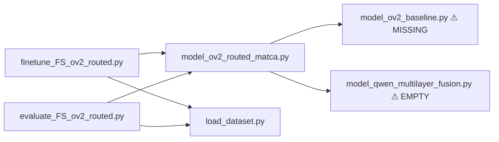

# OneVision-2 Routed MaTCA: Architecture & Operations Guide

**Purpose:** Operations guide for the OV2 routing / MoE / NGF extension on I-FailSense.
For the canonical architecture description (modules, data flow, ablation ladder, results),
see **[`OV2_ROUTED_ARCHITECTURE.md`](OV2_ROUTED_ARCHITECTURE.md)**.

**Last updated:** 2026-06-28. Paper plan: [`PAPER_PLAN.md`](PAPER_PLAN.md).

---

## Table of contents

1. [Executive summary](#1-executive-summary)
2. [Current status & blockers](#2-current-status--blockers)
3. [Repository map](#3-repository-map)
4. [End-to-end data flow](#4-end-to-end-data-flow)
5. [Architecture (detailed)](#5-architecture-detailed)
6. [Module reference](#6-module-reference)
7. [Training driver](#7-training-driver)
8. [Evaluation driver](#8-evaluation-driver)
9. [Datasets & transfer protocol](#9-datasets--transfer-protocol)
10. [GADI environment & paths](#10-gadi-environment--paths)
11. [Job scripts & experiment matrix](#11-job-scripts--experiment-matrix)
12. [Checkpoint artifacts](#12-checkpoint-artifacts)
13. [CLI reference](#13-cli-reference)
14. [Reading results & go/no-go](#14-reading-results--gono-go)
15. [Review checklist for tomorrow](#15-review-checklist-for-tomorrow)

---

## 1. Executive summary

This work extends the I-FailSense-style **post-LLM eval pipeline** (task-conditioned pooling +
fusion MLP — personal design, I-FailSense-inspired, fusion instead of voting; **not claimed as
novel**) to **LLaVA-OneVision-2-8B-Instruct** (OV2) with optional **pre-LLM Stage-1 modules**
that modulate visual tokens before the patch merger. **Paper contributions target Stage-1 only.**

**Completed matrix (CALVIN train → CALVIN + DROID eval, balanced DROID, LayerNorm fix):**

| Variant | Stage-1 | CALVIN AUROC | CALVIN→DROID AUROC | Script |
| --- | --- | --- | --- | --- |
| Baseline | none | 0.960 | 0.773 | `02` |
| Flat router | `--use_router` | 0.972 | **0.831** | `03` |
| MoE | `--use_moe` | 0.978 | 0.803 | `06` |
| Hier router | `--use_hier_router` | 0.979 | 0.792 | `09` |
| Router + adapter | `--use_router --use_merger_adapter` | 0.975 | **0.832** | `12` |
| NGF-0 v2 | `--use_nested_guided_fusion` | 0.993 | 0.792 | `17` |
| NGF A2 (inner off) | `--ngf_no_inner` | 0.988 | 0.809 | `17_ablate_inner_off` |
| NGF Arch B | `--ngf_layer_weight_mode token` | 0.998 | 0.787 | `19_ngf_v2b` |
| NGF Arch C | `--ngf_sequential` | 0.983 | 0.804 | `19_ngf_v2c` |

**Lead result (M0):** flat router + merger adapter (**0.832** CALVIN→DROID AUROC) — **last-layer** contrastive routing, no multilayer ViT hooks.

**Multilayer branch (M1–M5):** NGF v2 fixes pre-v2 collapse but **has not beaten M0** on transfer (best NGF A1: 0.812). Phase 1 FFN-Act intermediate-only collapsed to 0.498. See [`PAPER_PLAN.md`](PAPER_PLAN.md) and [`SUMMARY_OV2_RESULTS.md`](SUMMARY_OV2_RESULTS.md) §8–10.

The frozen 8B backbone is never fine-tuned. Trainable: **Stage-1** modules (+ optional merger adapter) and the fixed post-LLM eval pipeline weights.

---

## 2. Current status

### Code (all wired)

| File | Role |
| --- | --- |
| `src/model_ov2_routed_matca.py` | Full model: Stage-1 (router/MoE/hier/NGF) + merger adapter + post-LLM eval pipeline |
| `src/finetune_FS_ov2_routed.py` | Training CLI (NGF, adapter, beta-reg flags) |
| `src/evaluate_FS_ov2_routed.py` | Evaluation + grounding probe + NGF diagnostics |
| `src/model_ov2_baseline.py` | Prompts, labels (restored) |
| `src/model_qwen_multilayer_fusion.py` | Post-LLM eval pipeline blocks (pooling + fusion MLP; LayerNorm fix) |
| `gadi_scripts/ov2_routing/*.sh` | 34 PBS scripts (baseline through NGF v2 follow-up) |

### Fixes applied (2026-06-23)

1. **LayerNorm** replaces BatchNorm in fusion MLP blocks — baseline now learns (0.94 CALVIN acc). Engineering fix only.
2. **DROID balancing** via `augment_droid_dataset` in train + eval drivers (on by default).
3. **NGF v2 inner residual** (`h_l = V_l + beta_l · Delta_l`) — fixes pre-v2 collapse (~50% acc).

### Active follow-up runs (2026-06-28)

- Phase 0b text-guided ViT probes (`26_*` on dgxa100)
- Phase 1 collapse isolation ablations A–E (`27_phase1_ablation_*`)
- Arch C multi-seed (`20_ngf_v2c_seq_s*`)
- Beta-reg NGF-0 (`21_ngf_v2_breg01/05`)
- Remaining NGF ablations A3–A8 on gpuhopper

### GADI environment (required)

```bash
export HF_HOME=/scratch/ka69/yc0686/hf_cache
export HF_HUB_OFFLINE=1 TRANSFORMERS_OFFLINE=1
VLM_MODEL=/scratch/ka69/yc0686/models/LLaVA-OneVision-2-8B-Instruct
# pass --vlm_model_id "${VLM_MODEL}" on every python call
```

---

## 3. Repository map

```
I-FailSense-main/
├── README.md                          # Original I-FailSense (Qwen3-VL); see OV2 section
├── OV2_ROUTING_TRAINING.md            # ← this file (architecture + ops)
├── .venv-ov2/                         # Python 3.11 env for OV2 (pytorch/2.12.0 module)
├── gadi_scripts/ov2_routing/
│   ├── 00_cache_data.sh               # Login-node dataset download
│   ├── 01_smoke.sh                    # 30-sample GPU smoke (baseline + routed + MoE)
│   ├── 02_train_eval_calvin_baseline.sh
│   ├── 03_train_eval_calvin_routed.sh
│   ├── 04_train_eval_droid_baseline.sh
│   ├── 05_train_eval_droid_routed.sh
│   ├── 06_train_eval_calvin_moe.sh
│   └── 07_train_eval_droid_moe.sh
└── src/
    ├── model_ov2_routed_matca.py      # Core model (intact)
    ├── model_ov2_baseline.py          # MISSING — prompts, label mapping, OV2 defaults
    ├── model_qwen_multilayer_fusion.py # EMPTY — MaTCA head building blocks
    ├── finetune_FS_ov2_routed.py      # Training entry point
    ├── evaluate_FS_ov2_routed.py      # Evaluation entry point
    └── load_dataset.py                # Shared dataset loader
```

**Dependency graph:**



---

## 4. End-to-end data flow

For a single training sample `(images, task, label)`:

```
1. Query construction (if routing/MoE enabled)
   task text  → frozen LM embed → mean-pool → t_task  [B, 4096]
   fail template → frozen LM embed → mean-pool → t_fail [B, 4096]
   fail template = "Visual evidence that the following robot task was not
                    successfully completed: {task}"

2. Prompt + image preprocessing
   build_messages(images, task) → chat template → processor → input_ids, pixel_values

3. Vision encoder (frozen OV2 visual tower)
   pixel_values → encoder layers → hidden_states[0..L]
   │
   ├─ [optional Stage 1a] HierarchicalVisionFusion on merger-input layer
   │     V_hier = V_base + α · transform(Σ w_l · V_l)     α init = 0
   │
   └─ [optional Stage 1b] DualQueryRouter or MoEFailureRouter on same tokens
         gates from t_task / t_fail; values U = W_u(V) are PURELY visual
         V_routed = V + β · Delta                              β init = 0
   │
   patch merger (frozen) → projected tokens enter LLM

4. LLM decoder (frozen, gradient-checkpointed when Stage-1 is active)
   output_hidden_states=True → pick layers [19, 28, 36]  (default)

5. Stage 2 — post-LLM eval pipeline (MaTCA naming; trainable but not a claimed contribution)
   per layer: TaskConditionedPooling(features, text_mask) → pooled [B, 4096]
   per layer: MLP classifier → logit
   LearnedLayerFusion(stacked pools) → fused [B, 4096] → fused classifier → logit

6. Loss
   BCEWithLogits on fusion logit (default loss_mode=fusion)
   + MoE load-balance aux (if MoE)
   + optional supervised gate CE (if failure_mode_id present)
```

**Label convention:** `label_to_binary`: `fail → 0`, `success → 1`.

**Batch-size constraint:** When any Stage-1 module is active, forward requires
`batch_size=1` because routing hooks operate on per-sample query embeddings and
the 8B LM is backpropped through with gradient checkpointing.

---

## 5. Architecture (detailed)

### 5.1 Backbone: LLaVA-OneVision-2-8B-Instruct

- **Model ID (default):** `lmms-lab-encoder/LLaVA-OneVision-2-8B-Instruct`
- **Revision (default):** `5a75eaf7d3cd73de6f85e637e45b420f46857d2e`
- **Local copy:** `/scratch/ka69/yc0686/models/LLaVA-OneVision-2-8B-Instruct`
- **Vision dim:** 1024 (`vision_config.hidden_size`)
- **LM hidden dim:** 4096 (`text_config.hidden_size`)
- **Precision:** bfloat16 backbone; trainable modules in float32
- **Attention:** SDPA (`attn_implementation="sdpa"`)
- **Max pixels:** 200704 (controls visual token budget)

The entire `AutoModelForImageTextToText` is frozen (`requires_grad=False`, kept in
`eval()` mode). During routed training, gradients flow *through* the frozen LM to
reach the upstream router — hence gradient checkpointing is enabled.

### 5.2 Insertion point: `_RoutedMerger`

The vision encoder's patch merger is wrapped so routing runs immediately before merging:

```python
# model_ov2_routed_matca.py — simplified
class _RoutedMerger(nn.Module):
    def forward(self, x, patch_positions=None):
        x = parent.apply_upstream(x)   # Stage 1a + 1b here
        return self.merger(x, patch_positions=patch_positions)
```

An encoder forward hook captures `hidden_states` for hierarchical fusion.
The parent reference is stored in a list (not registered as a submodule) to avoid
making the 8B model a child of the merger.

### 5.3 Stage 1a: `HierarchicalVisionFusion` (optional, `--use_hier_fusion`)

Fuses multiple vision-encoder depths into a residual on the merger's input layer.

**Modes (`fusion_mode`):**

| Mode | Weight computation |
| --- | --- |
| `static` | Global softmax over learnable logits (shared across samples) |
| `dynamic` | Per-sample softmax from mean-pooled layer features |
| `mean` | Uniform 1/L average (no learnable weights) |

**Formula:**

```
V_multi = Σ_l w_l · V_l          (selected vision_layer_indices, default [9, 17, 24])
V_hier  = V_base + α · transform(V_multi)     α initialized to 0
```

At init, `α = 0` → identity → pretrained interface preserved.

### 5.4 Stage 1b: `DualQueryRouter` (optional, `--use_router`)

Modulates spatial visual tokens using task and failure-query embeddings from the
frozen LM embedding table.

**Core equations:**

```
K = W_K(V)                         keys from visual tokens
U = W_U(V)                         values — PURELY visual (grounding invariant)
q_t = W_Qt(t_task)                 task query
q_f = W_Qf(t_fail)                 failure query

g_t = gate(q_t, K, V)              per-patch relevance (sigmoid or softmax)
g_f = gate(q_f, K, V)              (when router_mode includes failure)

streams = concat evidence tensors  (width depends on router_mode)
Delta   = phi(streams)
V_routed = V + β · Delta           β initialized to 0
```

**Router modes (`--router_mode`):**

| Mode | Streams concatenated into `phi` | `num_streams` |
| --- | --- | --- |
| `task_only` | `[V; g_t·U]` | 2 |
| `task_fail` | `[V; g_t·U; g_f·U]` | 3 |
| `contrastive` | `[V; g_t·U; g_f·U; (g_t−g_f)·U]` | 4 |

Default for all CALVIN jobs: **`contrastive`**.

**Gate styles (`--gate_style`):**

| Style | Mechanism |
| --- | --- |
| `multiplicative` (default) | `g = sigmoid(q·K/√d)` or `softmax(...)` scales visual values |
| `guiding` (QMSA ablation) | `g = softmax(base(V) + q·K/√d)` — additive attention bias |

### 5.4c Stage 1c: `HierarchicalDualQueryRouter` (optional, `--use_hier_router`)

Applies a **shared** `DualQueryRouterCore` at each vision depth, then fuses per-depth
deltas with query-conditioned depth weights. Mutually exclusive with `--use_router`,
`--use_hier_fusion`, and `--use_moe`.

**Formula:**

```
For l in {vision_layer_indices..., base}:
    delta_l = core.compute_delta(V_l, q_task, q_fail)
w = softmax(depth_scorer(q_task, q_fail, mean_pool(V_l)...))   # query_cond default
Delta = Σ_l w_l · delta_l
V_out = V_base + β · Delta,   β init 0
```

**Hooks:** encoder forward hook stores the ``hidden_states`` tuple (indices 0..24
for the 24-block OV2 ViT); merger input is post-norm ``V_base``.

**Depth fusion modes (`--depth_fusion_mode`):**

| Mode | Weight computation |
| --- | --- |
| `query_cond` (default) | MLP on concat(`q_task`, `q_fail`, pooled features per depth) |
| `static` | Global softmax over learnable logits (ablation) |

**Recommended pairing:** `--use_hier_router --router_mode contrastive --pooling_mode hybrid`
(task-agnostic MaTCA; hierarchical router owns task/failure grounding).

### 5.5 Stage 1b (alt): `MoEFailureRouter` (optional, `--use_moe`)

Replaces the single `phi` MLP with **E expert MLPs** and per-token top-k routing.
Reuses `DualQueryRouter.build_streams()` for the gated evidence (grounding invariant
preserved).

```
streams_n ∈ R^{num_streams · Dv}     per patch n
gate_logits[n,e] = W_g([V_n ; q_t ; q_f])
top-k softmax over experts → g_{n,e}
Delta_n = Σ_{e ∈ topk} g_{n,e} · phi_e(streams_n)
V_routed = V + β · Delta
```

**Load balancing:** Relaxed Switch-style aux loss:

```
aux = E · Σ_e P_e · f_e
```

where `P_e` = mean soft gate probability to expert `e`, `f_e` = fraction of tokens
routed to `e`. Weighted by `--load_balance_coef` (default 0.01; small so rare-failure
experts can specialize on label-free CALVIN/DROID).

**Supervised gate (optional):** `--moe_gate_supervision` applies CE on mean-pooled
gate logits when `failure_mode_id` is in the dataset batch. **No-op on CALVIN/DROID**
(binary labels only).

### 5.6 Grounding invariant ("blocking")

Text (task/failure queries) may only form **scalar per-patch gates**. The routed
values `U = W_u(V)` are a projection of visual tokens only — query text never writes
content into the residual `Delta`.

This structurally prevents "compression hallucination" (a monitor that simply confirms
whatever the prompt assumes). The `--grounding_check` eval probe measures prediction
change when query text is swapped to an unrelated task while images are held fixed.

### 5.7 Stage 2: Post-LLM eval pipeline (MaTCA naming — not a contribution)

**Not claimed as novel.** Personal readout stack (I-FailSense-inspired task-conditioned pooling + **fusion MLP**, not voting). Held fixed across experiments so Stage-1 can be ablated fairly. Implemented in `model_qwen_multilayer_fusion.py`.

**Default configuration (all CALVIN jobs):**

| Setting | Value |
| --- | --- |
| `target_layer_indices` | `[19, 28, 36]` |
| `num_classifiers` | 3 |
| `pooling_mode` | `tcond` (task-conditioned pooling) |
| `fusion_mode` | `static` (learned softmax over layers) |
| `loss_mode` | `fusion` |
| `prediction_mode` | `fusion` |

**Per-layer path:**

1. `TaskConditionedPooling(features, text_mask, attention_mask)`:
   - Mean-pool text tokens → `task_repr`
   - Attention over all tokens conditioned on `task_repr`
   - Returns `(pooled, task_repr, weights)`

2. `MLP_BLOCK(4096→1024) → MLP_BLOCK(1024→256) → LayerNorm → ReLU → Dropout → Linear(256→1)`

**Fusion path:**

- `LearnedLayerFusion` (static) or `DynamicLayerFusion` (per-sample layer weights)
- Same MLP classifier on fused representation
- Final prediction uses fusion logit by default

**Alternate pooling modes:** `hybrid`, `last_token`, `text_mean` (not used in current jobs).

---

## 6. Module reference

| Class | File | Trainable | When active |
| --- | --- | --- | --- |
| `HierarchicalVisionFusion` | `model_ov2_routed_matca.py` | yes | `--use_hier_fusion` |
| `_PatchGate` | same | yes (via router) | routing/MoE/hier router |
| `DualQueryRouterCore` | same | yes (via router/MoE/hier) | routing/MoE/hier router |
| `DualQueryRouter` | same | yes | `--use_router` or `--use_moe` |
| `HierarchicalDualQueryRouter` | same | yes | `--use_hier_router` |
| `MoEFailureRouter` | same | yes | `--use_moe` |
| `NestedGuidedFusion` | same | yes | `--use_nested_guided_fusion` (parallel) |
| `SequentialNestedFusion` | same | yes | `--use_nested_guided_fusion --ngf_sequential` (Arch C) |
| `TextLayerRouter` | same | yes | NGF outer α (`layer_weight_mode=text`) |
| `TokenDepthRouter` | same | yes | NGF Arch B (`layer_weight_mode=token`) |
| `MergerAdapter` | same | yes | `--use_merger_adapter` |
| `_RoutedMerger` / `_AdaptedRoutedMerger` | same | no (wraps frozen merger) | Stage-1 active |
| `OV2RoutedMaTCA` | same | head + Stage-1 | always |
| `TaskConditionedPooling` | `model_qwen_multilayer_fusion.py` | yes | `pooling_mode=tcond` |
| `HybridAttentionPooling` | same | yes | `pooling_mode=hybrid` |
| `LearnedLayerFusion` | same | yes | `fusion_mode=static\|mean` |
| `DynamicLayerFusion` | same | yes | `fusion_mode=dynamic` |
| `MLP_BLOCK` | same | yes | all classifiers |

**Key `OV2RoutedMaTCA` methods:**

| Method | Purpose |
| --- | --- |
| `forward(images, tasks)` | Returns list of logits `[head_0, ..., head_{N-1}, fused]` |
| `predict(..., prediction_mode)` | Sigmoid + threshold; modes: `fusion`, `head_average`, `head_majority` |
| `apply_upstream(x)` | Stage-1 on pre-merger visual tokens (called inside vision forward) |
| `trainable_parameters()` | Collects all non-frozen params for AdamW |
| `save_classifier(path, epoch)` | Saves `components*.pt` with full config |
| `load_classifier(path)` | Restores head + Stage-1 weights |

---

## 7. Training driver

**Entry point:** `src/finetune_FS_ov2_routed.py`

**Flow:**

1. Parse CLI args → `load_data()` for train and val splits
2. Construct `OV2RoutedMaTCA(**model_kwargs)`
3. Write `config.txt` (key=value pairs) to `result_folder`
4. Call `train_model(model, train_dataset, val_dataset, config)`

**`train_model` loop** (`model_ov2_routed_matca.py`):

- Optimizer: AdamW on trainable params only, `lr=1e-4`, `weight_decay=0.1`
- Scheduler: cosine annealing over all steps, `eta_min = lr × 0.01`
- Loss: `BCEWithLogitsLoss` on selected logits (`fusion` / `per_head` / `all`)
- Gradient clip: max norm 1.0
- Forces `batch_size=1` when Stage-1 is active
- Keeps `model.vlm.eval()` even during training (frozen backbone)
- Saves best checkpoint on val accuracy improvement
- Logs per-epoch: `train_loss`, `train_acc`, `val_acc`, `alpha` (hier fusion), `beta` (router/MoE/hier router), `depth_weights` (hier router), `expert_usage` (MoE), `ngf_layer_alpha`, `ngf_inner_beta` / `ngf_seq_beta` (NGF), `gamma` (merger adapter)

**Default CALVIN training hyperparameters (from job scripts):**

```
--num_epochs 5
--lr 1e-4 --weight_decay 0.1 --dropout_rate 0.1
--target_layer_indices 19 28 36 --num_classifiers 3
--pooling_mode tcond --loss_mode fusion --prediction_mode fusion
```

---

## 8. Evaluation driver

**Entry point:** `src/evaluate_FS_ov2_routed.py`

**Flow:**

1. Load `config.txt` + checkpoint metadata from `--fs_id`
2. Reconstruct `OV2RoutedMaTCA` with saved config
3. `load_classifier(best_checkpoint)`
4. Iterate dataset, accumulate metrics
5. Write `results.json` to `--result_folder`

**Metrics in `results.json`:**

| Category | Fields |
| --- | --- |
| Classification | `accuracy`, `precision`, `recall`, `f1`, `confusion_matrix` |
| Probabilistic | `auroc`, `average_precision`, `ece`, `brier` |
| Routing | `layer_fusion_weights`; training logs also print `alpha`, `beta` |
| MoE | `expert_usage_hist`, `mean_gate_entropy_nats` |
| Grounding | `grounding_flip_rate`, `grounding_mean_prob_shift` (with `--grounding_check`) |

**Grounding probe:** Re-runs prediction with task text replaced by
`"a completely unrelated background scene with no robot activity"` on the same images.
Reports how often the binary prediction flips and mean absolute probability shift.

---

## 9. Datasets & transfer protocol

Loaded via `load_data()` in `src/load_dataset.py`.

**CALVIN-1p (primary train set for tonight's jobs):**

- HF dataset: `ACIDE/AHA-Calvin-1p`
- Train split: `train`
- Test split: `validation` → 90/10 `train_test_split(seed=42)` → `test`
- Columns renamed: `image → images`, `success → label`
- POV 1, style `image`

**DROID-1p (cross-dataset eval):**

- Train: `ACIDE/DROID_1p_1k`
- Test: `ACIDE/DROID_1p_bench`
- POV 1, style `image`

**Transfer matrix (CALVIN-trained jobs):**

| Job | Train | Eval in-domain | Eval cross-dataset |
| --- | --- | --- | --- |
| 02 baseline | CALVIN-1p | CALVIN-1p test | DROID-1p test |
| 03 routed | CALVIN-1p | CALVIN-1p test (+ grounding) | DROID-1p test (+ grounding) |
| 06 MoE | CALVIN-1p | CALVIN-1p test (+ grounding) | DROID-1p test (+ grounding) |

Cross-dataset transfer is the **primary signal** for whether routing/MoE generalizes.

---

## 10. GADI environment & paths

### Module & venv

```bash
module purge && module load pytorch/2.12.0
cd /scratch/ka69/yc0686/robot_failure_classifier/I-FailSense-main
source .venv-ov2/bin/activate
```

### Environment variables (compute nodes — offline)

```bash
export TOKENIZERS_PARALLELISM=false
export HF_HOME=/scratch/ka69/yc0686/hf_cache          # datasets live here
export HF_HUB_OFFLINE=1
export TRANSFORMERS_OFFLINE=1
VLM_MODEL=/scratch/ka69/yc0686/models/LLaVA-OneVision-2-8B-Instruct
```

### PBS resources (all OV2 routing jobs)

```
#PBS -P ka69
#PBS -q gpuhopper
#PBS -l ncpus=12,ngpus=1,mem=64GB,jobfs=100GB
#PBS -l storage=gdata/ka69+scratch/ka69
```

### Cache datasets (login node, online)

```bash
bash gadi_scripts/ov2_routing/00_cache_data.sh
```

Run on a login node before any `qsub`. Uses internet to populate `HF_HOME`.

### Pre-flight verification (login node, no GPU)

```bash
module purge && module load pytorch/2.12.0
cd /scratch/ka69/yc0686/robot_failure_classifier/I-FailSense-main
source .venv-ov2/bin/activate
export HF_HOME=/scratch/ka69/yc0686/hf_cache
export HF_HUB_OFFLINE=1 TRANSFORMERS_OFFLINE=1

# 1) Import chain (fails until dependencies restored)
python -c "from model_ov2_routed_matca import OV2RoutedMaTCA; print('import ok')"

# 2) Dataset load (offline)
python -c "from load_dataset import load_data; ds=load_data('calvin','image',1,'train',num_entry=2); print(len(ds))"
```

### GPU smoke test

```bash
qsub gadi_scripts/ov2_routing/01_smoke.sh
```

Runs 30-sample, 1-epoch CALVIN-1p for baseline, routed, and MoE. Check `.o` log
for `Training complete` from all three.

---

## 11. Job scripts & experiment matrix

All scripts live in `gadi_scripts/ov2_routing/`. Full mapping in
[`OV2_ROUTED_ARCHITECTURE.md`](OV2_ROUTED_ARCHITECTURE.md) GADI jobs table.

### Core matrix (completed)

| Script | Queue | Train | Stage-1 | Output dir |
| --- | --- | --- | --- | --- |
| `02` baseline | gpuhopper | CALVIN | none | `results_ov2_calvin_baseline` |
| `03` routed | gpuhopper | CALVIN | `--use_router` | `results_ov2_calvin_routed` |
| `06` MoE | gpuhopper | CALVIN | `--use_moe` | `results_ov2_calvin_moe` |
| `09` hier router | gpuhopper | CALVIN | `--use_hier_router` | `results_ov2_calvin_hier_routed` |
| `12` router+adapter | gpuhopper | CALVIN | router + adapter | `results_ov2_calvin_routed_merger_adapter` |

### NGF v2 batch

| Script | Queue | Config | Output dir |
| --- | --- | --- | --- |
| `17` NGF-0 v2 | gpuhopper | primary NGF | `results_ov2_calvin_ngf_v2` |
| `17_ablate_*` | gpuhopper | A1–A8 ablations | `results_ov2_calvin_ngf_a*_v2` |
| `19_ngf_v2b` | dgxa100 | Arch B (token α) | `results_ov2_calvin_ngf_v2b_token` |
| `19_ngf_v2c` | dgxa100 | Arch C (sequential) | `results_ov2_calvin_ngf_v2c_seq` |
| `20_ngf_v2c_seq_s*` | dgxa100 | Arch C seeds | `results_ov2_calvin_ngf_v2c_seq_s{seed}` |
| `21_ngf_v2_breg*` | dgxa100 | beta L2 sweep | `results_ov2_calvin_ngf_v2_breg01/05` |

**Submit batches:**

```bash
bash gadi_scripts/ov2_routing/18_submit_overnight_ngf_v2.sh   # 6 jobs
bash gadi_scripts/ov2_routing/22_submit_followup_ngf_v2.sh      # 4 follow-up jobs
```

Each script runs train + in-domain CALVIN eval + cross-dataset DROID eval with `--grounding_check`.

---

## 12. Checkpoint artifacts

Each training run writes to `--result_folder`:

```
results_ov2_calvin_routed/
├── config.txt                         # key=value training config
├── components_best_epoch_N.pt         # best val_acc checkpoint
└── components_epoch_M.pt              # per-epoch snapshots
```

**Checkpoint contents (`components*.pt`):**

- Config: `num_classifiers`, `target_layer_indices`, `pooling_mode`, `fusion_mode`,
  `use_hier_fusion`, `use_router`, `use_moe`, `router_mode`, `gate_type`, `gate_style`,
  `num_experts`, `moe_top_k`, `load_balance_coef`, ...
- Weights: `classifier_{i}`, `attention_pooling_{i}`, `layer_fusion`, `fused_classifier`
- Optional: `hier_fusion`, `router`, `moe`

Eval auto-discovers the latest `*best*` checkpoint in `--fs_id`.

---

## 13. CLI reference

### Training (`finetune_FS_ov2_routed.py`)

| Flag | Default | Meaning |
| --- | --- | --- |
| `--vlm_model_id` | OV2 HF id | Path or HF id for backbone |
| `--dataset_name` | `calvin` | `calvin`, `droid`, `aha` |
| `--pov` | `1` | Camera viewpoint (1/2/3) |
| `--num_epochs` | `5` | Training epochs |
| `--batch_size` | `2` | Forced to 1 when Stage-1 active |
| `--lr` | `1e-4` | AdamW learning rate |
| `--target_layer_indices` | `19 28 36` | LM layers for MaTCA heads |
| `--pooling_mode` | `tcond` | `tcond`, `hybrid`, `last_token`, `text_mean` |
| `--fusion_mode` | `static` | `static`, `dynamic`, `mean` |
| `--loss_mode` | `fusion` | `fusion`, `per_head`, `all` |
| `--use_hier_fusion` | off | Enable Stage-1a |
| `--vision_layer_indices` | `9 17 24` | Vision depths for hier fusion |
| `--use_router` | off | Enable dual-query router |
| `--use_hier_router` | off | Enable hierarchical per-depth dual-query router |
| `--depth_fusion_mode` | `query_cond` | `query_cond` or `static` (hier router ablation) |
| `--router_mode` | `contrastive` | `task_only`, `task_fail`, `contrastive` |
| `--gate_type` | `sigmoid` | `sigmoid`, `softmax` |
| `--gate_style` | `multiplicative` | `multiplicative`, `guiding` |
| `--use_moe` | off | Enable MoE (mutually exclusive routing path for `phi`) |
| `--num_experts` | `4` | Number of failure experts |
| `--moe_top_k` | `2` | Active experts per visual token |
| `--load_balance_coef` | `0.01` | MoE load-balance weight |
| `--moe_gate_supervision` | off | Supervise gate with `failure_mode_id` |
| `--use_merger_adapter` | off | Parallel trainable merger connector |
| `--merger_adapter_rank` | `64` | Bottleneck rank for adapter |
| `--use_nested_guided_fusion` | off | NGF (mutually exclusive Stage-1) |
| `--ngf_layer_weight_mode` | `text` | `text`, `static`, `uniform`, `token` (Arch B) |
| `--ngf_sequential` | off | Arch C: sequential depth-recurrent refinement |
| `--ngf_no_inner` | off | Disable inner guiding (A2 ablation) |
| `--nested_residual` | off | Blend `V_base + eta*(F-V_base)` instead of replace |
| `--layer_balance_coef` | `0.0` | NGF depth-α entropy penalty (NGF-0 uses 0.01) |
| `--ngf_inner_beta_l2` | `0.0` | L2 on inner_betas / beta_seq (transfer regularisation) |
| `--seed` | `42` | Random seed |
| `--result_folder` | `./results_ov2_routed` | Output directory |

### Evaluation (`evaluate_FS_ov2_routed.py`)

| Flag | Meaning |
| --- | --- |
| `--fs_id` | Trained checkpoint folder |
| `--dataset_name` / `--pov` / `--split` | Eval data selection |
| `--prediction_mode` | `fusion`, `head_average`, `head_majority` |
| `--grounding_check` | Run query-swap grounding probe |
| `--task_substitution` | Replace all task strings (intervention) |
| `--result_folder` | Where to write `results.json` |

---

## 14. Reading results & go/no-go

**Primary metric under domain shift: CALVIN→DROID AUROC** (balanced DROID eval).

Compare `eval_results/*/results.json` across configs. Key fields:

| Metric | Where | What to look for |
| --- | --- | --- |
| Cross-domain AUROC | `*_to_droid/results.json` | Primary transfer signal |
| In-domain AUROC/acc | `*_indomain/results.json` | Ceiling check (~0.94–0.99) |
| `ngf_inner_beta` / `ngf_seq_beta` | NGF eval JSON | Scales grew away from 0 |
| `ngf_layer_alpha` | NGF eval JSON | Depth collapse? (one weight ≈ 1) |
| `beta` / `gamma` | training log | Router/adapter engagement |
| `grounding_flip_rate` | routed/NGF eval | Query sensitivity |

**Current read (2026-06-26):**

- Flat router + adapter (**0.832**) remains transfer champion.
- NGF-0 v2 fixes collapse; strong in-domain (0.993) but transfer (0.792) below router+adapter.
- A2 inner-off (0.809) and A1 uniform v2 (0.812) beat NGF-0 v2 on transfer — inner guiding may overfit CALVIN.
- Beta-reg sweep (`21_ngf_v2_breg*`) tests whether `--ngf_inner_beta_l2` recovers A2-level transfer while keeping inner guiding.

---

## 15. Review checklist

### Architecture docs

- [ ] [`OV2_ROUTED_ARCHITECTURE.md`](OV2_ROUTED_ARCHITECTURE.md) — canonical module/data-flow reference
- [ ] [`EXPERIMENT_RUN_SCHEDULE.md`](EXPERIMENT_RUN_SCHEDULE.md) — full run registry and tracks
- [ ] [`SUMMARY_OV2_RESULTS.md`](SUMMARY_OV2_RESULTS.md) — baseline/routed/MoE matrix + NGF section

### Code review

- [x] `model_ov2_baseline.py` and `model_qwen_multilayer_fusion.py` restored
- [x] NGF v2 inner residual: `h_l = V_l + beta_l * Delta_l`
- [x] Arch B (`TokenDepthRouter`) and Arch C (`SequentialNestedFusion`) wired
- [ ] Beta-reg loss (`ngf_inner_beta_l2`) improves transfer without killing in-domain
- [ ] Grounding invariant preserved in all NGF modes

### Results review

- [x] Compare baseline vs routed vs MoE (`SUMMARY_OV2_RESULTS.md`)
- [x] NGF v2 primary + Arch B/C complete
- [ ] Remaining ablations A3–A8 + beta-reg sweep
- [ ] ≥3 seeds on best config for publication

### Ablation matrix (hierarchical router)

Run on the same seed budget; primary metric = **cross-domain AUROC**:

| Stage 1 | Stage 2 pooling | Purpose |
| --- | --- | --- |
| `--use_router` (current) | `tcond` | Existing baseline |
| `--use_hier_router` | `hybrid` | **Primary new config** |
| `--use_hier_router` | `tcond` | Is hybrid necessary? |
| `--use_hier_router --depth_fusion_mode static` | `hybrid` | Is query-conditioned depth fusion necessary? |

---

## Appendix: relationship to original I-FailSense

The original repo (see `README.md`) trains a Qwen3-VL backbone with LoRA (Phase 1)
then FS blocks / post-LLM head (Phase 2). This OV2 extension:

- Swaps backbone to **LLaVA-OneVision-2-8B** (no LoRA; fully frozen)
- Reuses the **same post-LLM eval pipeline** from `model_qwen_multilayer_fusion.py` (MaTCA naming: I-FailSense-inspired pooling + fusion MLP, not voting — personal pipeline, not a claimed contribution)
- Adds **Stage-1 pre-LLM routing/fusion** (**claimed contribution space**)
- Uses CALVIN/DROID as a **fast transfer testbed** before committing to BDV2/UR5

The original `finetune_FS.py` / `evaluate.py` pipeline is unchanged and independent
of the OV2 routing code path.
