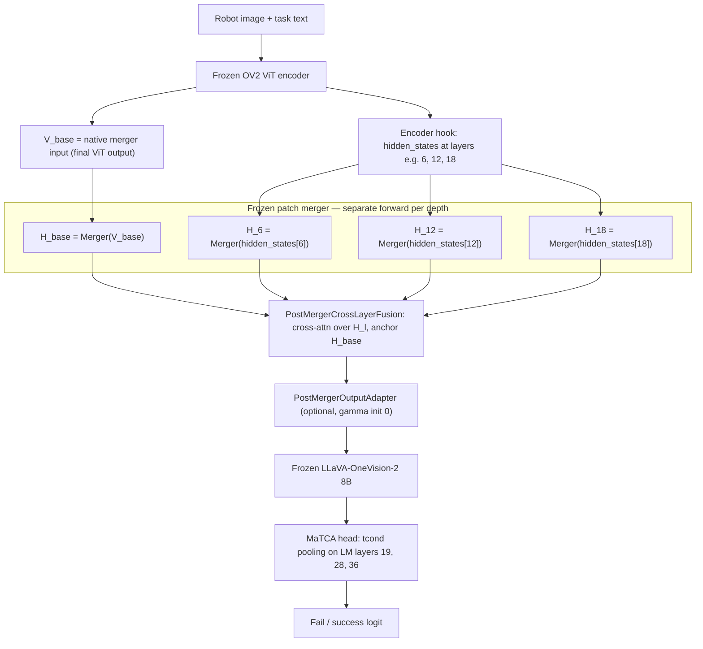

# Post-Merger ALF — Fuse-After-Merger Multilayer Fusion

This document describes **post-merger ALF fusion** (`--use_post_merger_alf`): an
ALF-inspired cross-attention module that combines **multiple frozen patch-merger
outputs** in LLM token space (4096-d), anchored on the native `H_base` path.

**Motivation:** NGF and fuse-then-route blend ViT features **before** the
vision→LLM projector. Post-merger ALF asks whether intermediate depths are more
useful **after** each depth has been passed through the **same frozen merger** the
pretrained model was trained with — fusion happens where the LLM actually reads tokens.

**Implementation:** `PostMergerCrossLayerFusion`, `PostMergerOutputAdapter`,
`_PostMergerALFMerger` in [`src/model_ov2_routed_matca.py`](src/model_ov2_routed_matca.py)  
**Training script:** [`gadi_scripts/ov2_routing/31_train_eval_post_merger_alf.sh`](gadi_scripts/ov2_routing/31_train_eval_post_merger_alf.sh)  
**Layer selection probe (optional):** [`gadi_scripts/ov2_routing/30_probe_layer_select.sh`](gadi_scripts/ov2_routing/30_probe_layer_select.sh)  
**Smoke case:** section `(i)` in [`gadi_scripts/ov2_routing/01_smoke.sh`](gadi_scripts/ov2_routing/01_smoke.sh)

**Status (2026-07):** Implemented and smoke-tested in code; primary CALVIN→DROID
benchmark run pending on local GPU server (aloha-server). Compare against **M0
champion** (flat router + merger adapter, CALVIN→DROID AUROC **0.832**).

---

## 1. Idea in one sentence

Run the **frozen patch merger once per ViT depth** (intermediates + the normal
final input), then **fuse the resulting LLM-token fields** with task/failure-grounded
cross-attention — **no pre-merger routing or ViT-space blending**.

---

## 2. End-to-end pipeline



**Frozen:** OV2 ViT encoder, native patch merger weights, 8B LLM.  
**Trainable:** `PostMergerCrossLayerFusion`, optional `PostMergerOutputAdapter`,
and the post-LLM MaTCA head (personal eval pipeline — not a claimed contribution).

**Important:** `apply_upstream()` (flat router, NGF, fuse-then-route, MoE) is **not**
called on this path. The merger wrapper `_PostMergerALFMerger` replaces the native
merger and performs fusion inside the merger forward.

---

## 3. Notation

| Symbol | Shape | Meaning |
| --- | --- | --- |
| `B` | scalar | batch size (forced to 1 when Stage-1 active) |
| `M` | scalar | number of merged LLM tokens per image (after 2×2 patch merge) |
| `D` | scalar | LLM hidden dim after merger (**4096** for OV2) |
| `D_q` | scalar | query embedding dim (same as `D` for text queries) |
| `r` | scalar | ALF router bottleneck (`--alf_router_dim`, default 256) |
| `L` | scalar | number of **intermediate** depths (not counting base) |
| `V_base` | `[B, N, D_v]` | native pre-merger patch grid from final ViT output |
| `H_base` | `[B, M, D]` | `Merger(V_base)` — anchor stream |
| `H_l` | `[B, M, D]` | `Merger(hidden_states[l])` for intermediate index `l` |
| `t_task` | `[B, D_q]` | frozen task-text embedding |
| `t_fail` | `[B, D_q]` | frozen failure-template embedding |
| `beta` | scalar | ALF residual scale on anchor (init **0** → identity) |
| `gamma` | scalar | output adapter scale (init **0** → identity) |

Default intermediate indices: `{6, 12, 18}` (overridable; see §8).

---

## 4. Fusion math (`PostMergerCrossLayerFusion`)

For each merged token position `n` and each intermediate depth `l ∈ {1…L}`:

```
Q_n     = W_q · H_base[n]                         # [r]
K_l,n   = W_k · H_l[n]                            # [r]
V_l,n   = W_v · H_l[n]                            # [D]

content_l = (Q_n · K_l,n) / sqrt(r)
text_l    = (q_task · K_l,n) / sqrt(r) + (q_fail · K_l,n) / sqrt(r)

logit_l   = content_l + text_l
alpha_l   = softmax_l(logit)                        # per-token depth weights
ctx_n     = Σ_l alpha_l · V_l,n
Δ_n       = W_o · ctx_n

H_out[n]  = H_base[n] + beta · Δ_n                  # beta = 0 at init
```

**Grounding / blocking invariant:** task and failure text enter only the **attention
logits** (`text_l`). Values `V_l,n` come only from merged visual streams. Text never
writes content into the residual — same rule as the dual-query router and NGF.

**Identity at init:** `beta = 0` ⇒ `H_out = H_base` exactly (pretrained merger→LLM
interface preserved until training moves `beta`).

**Logging:** batch-mean `alpha_l` stored in `post_merger_fusion.last_alpha` for
depth-usage diagnostics during training.

---

## 5. Output adapter (`PostMergerOutputAdapter`)

Optional low-rank residual on fused tokens (4096-d analogue of job-12 `MergerAdapter`):

```
H' = H_out + gamma · Up(GELU(Down(LN(H_out))))
```

`gamma` init = 0 → no effect until training. Enabled by default when
`--use_post_merger_alf` is set (`--post_merger_adapter_rank 64`).

---

## 6. How it differs from other Stage-1 variants

| Method | Fusion space | Merger calls | Pre-merger routing? | Script |
| --- | --- | --- | --- | --- |
| **M0 champion** | ViT patches → router on `V_base` | 1 (+ adapter on input) | Yes (flat dual-query) | `12` |
| **NGF-0 v2** | ViT patch space; `F` replaces `V_base` | 1 (+ merger adapter) | Yes (inner guiding + outer α) | `17` |
| **Fuse-then-route (M2)** | ViT: TGIF fuse → one router | 1 (+ adapter) | Yes | `14` |
| **Post-merger ALF** | **4096-d LLM tokens** after merger | **L + 1** (frozen) | **No** | `31` |

**Hypothesis under test:** multilayer evidence is easier to use **after** projection
into LLM-native space, with `H_base` as a stable anchor — inspired by Attentive
Multilayer Fusion (ALF), extended with task/failure-grounded logits and the blocking
rule.

**Known trade-off:** `L + 1` merger forwards per image step → higher compute/memory
than single-path NGF or M0.

---

## 7. Mutual exclusion

`--use_post_merger_alf` cannot be combined with:

- `--use_router`
- `--use_hier_router`
- `--use_fuse_then_route`
- `--use_nested_guided_fusion`
- `--use_moe`
- `--use_hier_fusion`

One Stage-1 family per run.

---

## 8. CLI and run configuration

### Flags

| Flag | Default | Meaning |
| --- | --- | --- |
| `--use_post_merger_alf` | off | Enable fuse-after-merger path |
| `--vision_layer_indices` | (required) | Intermediate ViT `hidden_states` indices |
| `--alf_router_dim` | 256 | Cross-attention bottleneck `r` |
| `--post_merger_adapter_rank` | 64 | Low-rank adapter bottleneck |
| `--pooling_mode` | `tcond` | Post-LLM MaTCA pooling (job 31 uses `tcond`) |
| `--target_layer_indices` | `19 28 36` | LM layers for MaTCA heads |

### Layer selection

Job `31` resolves intermediate depths in order:

1. Environment override: `VISION_LAYERS="6 12 18"`
2. Probe output: `eval_results/ov2_probe_layer_select/layer_select.json` (from job `30`)
3. Fallback: `6 12 18`

The **base** stream always uses native `V_base` (final encoder output entering the
merger); `vision_layer_indices` lists **intermediates only**.

### Standard hyperparameters (match job 31)

```
--dataset_name calvin --pov 1
--num_epochs 5 --batch_size 1
--lr 1e-4 --weight_decay 0.1 --dropout_rate 0.1
--loss_mode fusion --prediction_mode fusion
```

### Result folders

| Artifact | Path |
| --- | --- |
| Train checkpoint | `results_ov2_calvin_post_merger_alf/` |
| CALVIN eval | `eval_results/ov2_calvin_post_merger_alf_indomain/` |
| DROID eval | `eval_results/ov2_calvin_post_merger_alf_to_droid/` |

---

## 9. How to run

### Gadi (PBS)

```bash
qsub gadi_scripts/ov2_routing/31_train_eval_post_merger_alf.sh
```

Optional layer override:

```bash
VISION_LAYERS="9 17 24" qsub gadi_scripts/ov2_routing/31_train_eval_post_merger_alf.sh
```

### Local GPU (no PBS)

```bash
source .venv-ov2/bin/activate
export PYTHONPATH=src
export VLM_MODEL=/path/to/LLaVA-OneVision-2-8B-Instruct
export HF_HOME=/path/to/hf_cache

# Smoke (30 samples, 1 epoch)
python src/finetune_FS_ov2_routed.py \
  --vlm_model_id "$VLM_MODEL" \
  --dataset_name calvin --pov 1 \
  --num_entry 30 --num_epochs 1 --batch_size 1 \
  --target_layer_indices 19 28 36 --num_classifiers 3 \
  --pooling_mode tcond --loss_mode fusion --prediction_mode fusion \
  --use_post_merger_alf --vision_layer_indices 6 12 18 \
  --post_merger_adapter_rank 64 --alf_router_dim 256 \
  --result_folder ./results_ov2_smoke_post_merger_alf
```

Then eval CALVIN + DROID with `evaluate_FS_ov2_routed.py` and `--grounding_check`
(see job `31` for full commands).

---

## 10. Evaluation and success criteria

**Primary metric:** CALVIN→DROID **AUROC** in `eval_results/..._to_droid/results.json`.

| Reference | CALVIN AUROC | CALVIN→DROID AUROC | Notes |
| --- | --- | --- | --- |
| **M0 (job 12)** | 0.975 | **0.832** | Transfer champion to beat |
| NGF A2 inner-off (M1) | 0.988 | 0.809 | Best multilayer **pre-merger** so far |
| NGF-0 v2 | 0.993 | 0.792 | Strong in-domain, weaker transfer |
| **Post-merger ALF** | *pending* | *pending* | This document's target run |

**Secondary metrics:** in-domain AUROC/accuracy, ECE, `grounding_flip_rate` (with
`--grounding_check`), training logs for `beta`, `gamma`, and `last_alpha` depth weights.

**Interpretation:**

- **Beat 0.832** → fuse-after-merger is the right multilayer design for transfer.
- **Strong CALVIN, weak DROID** (NGF-like) → in-domain depth fusion may overfit sim.
- **beta stays ~0** → fusion module not engaging; check LR / layers / probe selection.

---

## 11. Implementation map

| Component | Class / wrapper | Role |
| --- | --- | --- |
| Merger hook-in | `_PostMergerALFMerger` | Runs frozen merger per depth; calls fusion |
| Cross-attention | `PostMergerCrossLayerFusion` | ALF-style fuse in 4096-d |
| Token adapter | `PostMergerOutputAdapter` | Optional low-rank residual on `H_out` |
| Encoder hook | `_install_hooks` | Captures `hidden_states` for intermediate indices |
| Checkpoint keys | `post_merger_fusion`, `post_merger_adapter` | Saved/loaded with other Stage-1 weights |

Trainable parameter count is dominated by MaTCA + fusion projections; the 8B backbone
stays frozen. Gradient checkpointing is enabled when post-merger ALF is active.

---

## 12. Related documents

- [`NGF_0_V2.md`](NGF_0_V2.md) — pre-merger nested fusion (contrast)
- [`MERGER_ADAPTER_RUN.md`](MERGER_ADAPTER_RUN.md) — M0 champion (job 12)
- [`OV2_ROUTED_ARCHITECTURE.md`](OV2_ROUTED_ARCHITECTURE.md) — full Stage-1/2 reference
- [`PAPER_PLAN.md`](PAPER_PLAN.md) — method candidates M0–M5 and experiment phases
- [`EXPERIMENT_RUN_SCHEDULE.md`](EXPERIMENT_RUN_SCHEDULE.md) — master run registry

---

## 13. FAQ

**Q: Is this the same as ALF from the literature?**  
A: Same *spirit* (cross-attention over layer representations), but layers are
**merger outputs** in LLM space, and attention logits include **task + failure** queries
with a **blocking** value path.

**Q: Why not fuse at ViT layer 9/17/24 like NGF?**  
A: NGF uses block taps at 9/17/24 in patch space. Post-merger ALF typically uses
probe-selected intermediates (e.g. 6/12/18) **after** merger projection. Different
hypothesis, different index semantics — see `30_probe_layer_select.sh`.

**Q: Does this use the merger adapter from job 12?**  
A: No. Job 12's `MergerAdapter` sits on **pre-merger** `V_base`. Post-merger ALF uses
`PostMergerOutputAdapter` on **post-fusion** `H_out` in 4096-d. Both use gamma-init-0
residuals but at different points in the graph.
